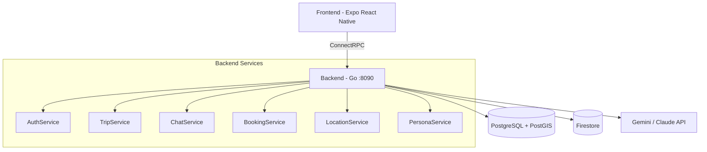
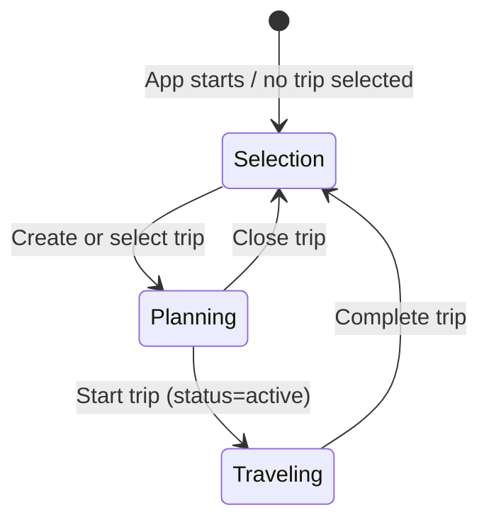

# Toqui Backend

AI-powered travel companion platform. Go backend with ConnectRPC, PostgreSQL, Firestore, and Claude/Gemini.

## Core Principles

### User Privacy — Non-Negotiable

Toqui exists to help travelers, not to exploit them. These rules are absolute and override any business or feature consideration:

**Data Collection:**
- Collect only what's needed to deliver the feature. If in doubt, don't collect it.
- Travel data is inherently sensitive — destinations can reveal religion, health conditions, sexuality, and political activity. Treat ALL travel data as potentially sensitive under GDPR Article 9.
- Never log, track, or store destination names, chat content, specific travel dates, hotel/flight names, or booking details in analytics. Track counts and categories, never content.
- Pseudonymize user IDs in any analytics or logging pipeline.

**Compliance:**
- Comply with EU GDPR as the baseline for ALL users, regardless of their location. Do not maintain separate privacy standards by region.
- Comply with Canadian PIPEDA. As a Canadian company, PIPEDA applies to all commercial activities.
- Apple App Tracking Transparency: use only first-party analytics. Never track users across apps or websites.
- Cookie-less analytics only. No tracking cookies, no fingerprinting, no IDFA/GAID collection.

**Monetization Ethics:**
- Affiliate revenue is acceptable and must be transparently disclosed (see toqui.travel/affiliate-disclosure).
- Never bias AI recommendations for revenue. The AI recommends what's best for the traveler, not what pays us the most.
- Never sell, share, or broker user data to third parties. Period.
- Never serve display advertising that tracks users.
- Sponsored/promoted placements, if ever introduced, must be clearly labeled and must not degrade recommendation quality.

**Analytics:**
- Session replay must mask all text inputs, chat content, and itinerary details.
- Analytics events track behavior patterns (user created a trip), never content (user planned a trip to Mecca).
- Self-hosted or EU-hosted analytics only. Google Analytics is explicitly prohibited (ruled non-compliant by multiple EU DPAs).
- Users must be informed about analytics in the privacy policy with a clear opt-out mechanism for EU users.

**Data Lifecycle:**
- GDPR Article 17 (right to deletion) and Article 20 (data portability) are implemented and must remain functional.
- Trip data is archived after 90 days of completion and eventually purged.
- Account deletion must be complete — no shadow profiles, no retained analytics, no "soft delete" that keeps data.

These principles are not aspirational. They are engineering requirements. Code that violates them must not be merged.

## Project Structure

This is a 5-repo project under `github.com/gallowaysoftware`:

- **toqui-backend** (this repo) — Go backend, ConnectRPC API, AI orchestration
- **toqui** — Expo React Native app (web + iOS + Android)
- **toqui-terraform** — Terraform GCP + Cloudflare infrastructure
- **toqui-site** — Astro static marketing site (Cloudflare Pages)
- **toqui-admin** — Vite React admin panel (Cloudflare Pages)

## Architecture



### Key Packages

| Package                 | Purpose                                                                                   |
| ----------------------- | ----------------------------------------------------------------------------------------- |
| `cmd/server`            | Main API server entry point                                                               |
| `cmd/migrate`           | Database migration runner                                                                 |
| `cmd/genguides`         | Dev-machine CLI that regenerates the curated 25-slug destination guide set from the persona system. See "Destination Guides Generator" below. |
| `internal/handlers/`    | ConnectRPC service handlers (auth, trip, chat, booking, location, persona)                |
| `internal/chat/`        | Chat service — AI streaming, tool execution, persona resolution                           |
| `internal/persona/`     | Persona composition — 43 locations × 23 themes = 989 expert combos                        |
| `internal/ai/`          | AI provider abstraction (Gemini primary, Claude fallback)                                 |
| `internal/ai/tools/`    | LLM-callable tool registry (WebSearch, Places)                                            |
| `internal/chatstore/`   | Firestore chat message persistence                                                        |
| `internal/lifecycle/`   | GDPR deletion, archival, data export                                                      |
| `internal/exportstorage/` | Export storage abstraction (GCS in prod, local filesystem for dev)                        |
| `internal/auth/`        | Google/Facebook OAuth + Apple Sign-In + JWT + auth interceptor + refresh token rotation (JTI/family). Apple sub-package: `internal/auth/apple/` (JWKS fetch + cache, ID-token verify, ES256 client-secret signer). |
| `internal/trip/`        | Trip CRUD, status transitions, destination management                                     |
| `internal/booking/`     | Booking ingestion + AI parsing (email, paste, manual)                                     |
| `internal/location/`    | Location service — ephemeral location cache (30 min TTL), nearby places (Google Places)   |
| `internal/theme/`       | Trip theme tagging (AI-driven classification)                                             |
| `internal/affiliate/`   | Affiliate link builder + scored fit ranker — generates partner URLs (Skyscanner, Booking.com, GetYourGuide, etc.) and ranks the candidate pool by tier-aware fit signals (#386). |
| `internal/config/`      | Three-layer config: env file → os.Getenv → GCP Secret Manager                             |
| `internal/db/`          | PostgreSQL connection pool + transaction helpers                                          |
| `internal/validate/`    | ConnectRPC interceptor for buf.validate constraints                                       |
| `internal/csrf/`        | CSRF protection middleware (Origin/Referer validation for state-changing requests)        |
| `internal/audit/`       | Structured audit logging for security-relevant events (via slog → Cloud Logging)         |
| `internal/analytics/`   | Server-side PostHog event ingestion + funnel/alert helpers (pseudonymized, EU-hosted)     |
| `internal/attribution/` | UTM/ref attribution parser — base64-decode + whitelist + sanitize for `signup_completed` |
| `internal/telemetry/`   | OpenTelemetry initialization + HTTP metrics middleware (OTLP exporter, Cloud Monitoring)  |
| `internal/middleware/`   | HTTP middleware (cookie-to-header auth bridge for web browser sessions)                   |
| `internal/ratelimit/`   | Per-user rate limiting interceptor + per-IP auth lockout (AuthLimiter)                    |
| `internal/email/`       | Transactional email via Resend API (waitlist verification, invite emails)                   |
| `internal/payment/`     | Stripe payment processing (Trip Pro checkout sessions, one-time purchases)                  |
| `internal/subscription/` | Stripe subscription management (Explorer/Voyager tiers, checkout, webhooks, portal)        |
| `internal/requestid/`   | HTTP middleware — generates unique request IDs, sets `X-Request-ID` response header         |
| `internal/tier/`        | User subscription tier logic (Free / Pro / Explorer / Voyager) and feature gating          |
| `internal/usage/`       | Daily usage tracking + message limit enforcement per user                                 |
| `tests/agentic/`        | Agentic test personas, booking artifacts, and orchestration                                |
| `cmd/testctl/`          | Test user/token management CLI for agentic testing                                        |
| `internal/integration/` | Integration test suite (build tag: `integration`)                                         |
| `internal/dbgen/`       | Generated sqlc query code (regenerate: `make sqlc`)                                       |
| `proto/toqui/v1/`       | Protobuf service definitions (7 files, 6 services, 31 RPCs)                               |
| `gen/toqui/v1/`         | Generated Go proto code (regenerate: `make proto`)                                        |

### Services (proto/toqui/v1/)

- **AuthService** — Google OAuth, Facebook OAuth, Apple Sign-In (scaffold; returns `Unimplemented` until Apple Developer enrollment completes), JWT refresh, account deletion/export
- **TripService** — Trip CRUD, itinerary management, templates, reorder
- **ChatService** — Streaming chat with AI, history, sessions
- **BookingService** — Booking ingestion (AI parsing), CRUD, update, price tracking, cost summary
- **PersonaService** — List/resolve/set default persona
- **LocationService** — Ephemeral location updates, nearby places

## Conventions

- **Logging**: Use `log/slog` for all Go logging. Structured key-value pairs, not `log.Printf` or `fmt.Printf`.
- **Imports**: Alias proto types as `toquiv1`, connect stubs as `toquiv1connect`.
- **ConnectRPC routes**: `/toqui.v1.ServiceName/MethodName`
- **Firestore paths**: `users/{uid}/trips/{tripId}/chatSessions/{sessionId}/messages`
- **SQL**: Use `sqlc.arg(name)` named parameters (not positional `$N`) for COALESCE-heavy queries.

## Request Pipeline

Every ConnectRPC request passes through the interceptor chain:

```
Request → validate.Interceptor → auth.Interceptor → age.Interceptor → ratelimit.Interceptor → Handler
```

- **validate**: Enforces `buf.validate` constraints on request protos (string lengths, UUID format, lat/lng bounds). Returns `InvalidArgument` on failure.
- **auth**: Extracts JWT from `Authorization` header, validates, injects user ID into context. Returns `Unauthenticated` on failure.
- **age**: Enforces the 18+ age verification gate — users who haven't completed `POST /auth/verify-age` cannot access gated RPCs. Returns `PermissionDenied` if age not verified. The gate runs **after** OAuth (not before login as in the original design) — login responses include an `age_verification_required` flag the frontend uses to mount the form. If the user submits a DOB indicating <18, the handler **hard-deletes the user** via `lifecycle.Service.DeleteUser` and records the email's SHA-256 in `under_age_blocks` so subsequent OAuth attempts with the same email are refused at login (`auth.login_denied.under_age` audit event). The DOB itself is never stored — only `users.age_verified_at` (timestamp).

**Consent flow**: Login responses (Google/Facebook/Apple OAuth, gRPC `GoogleLogin`/`FacebookLogin`/`AppleLogin`, and `POST /auth/exchange`) include a `consent_pending` flag. When true, the frontend must show a consent modal and call `POST /auth/consent` with `{"terms_accepted": true, "privacy_accepted": true, "marketing_opt_in": bool}` before the user can proceed. Individual consents can also be managed via `POST /api/privacy/consents` and `DELETE /api/privacy/consents/{type}`.
- **ratelimit**: Per-user token bucket. Separate limits for AI RPCs (SendMessage) vs general RPCs. Returns `ResourceExhausted` when exceeded.

## Development

```bash
make run              # Run server (local, default)
make run-staging      # Run locally against staging infrastructure
make run-prod         # Run locally against prod infrastructure
make build            # Build server binary
make test             # Run unit tests
make lint             # Run golangci-lint
make proto            # Generate Go proto code + lint
make sqlc             # Generate Go from SQL queries
make docker-up        # Start Postgres + Firestore emulator
make docker-down      # Tear down
```

TS proto bindings are generated in the frontend repo (`pnpm generate` in `../toqui`).

### gRPC Reflection

gRPC reflection is enabled on the server. You can use `grpcurl` to explore and test RPCs:

```bash
# List all services
grpcurl -plaintext localhost:8090 list

# Describe a service
grpcurl -plaintext localhost:8090 describe toqui.v1.TripService

# Call an RPC (with auth)
grpcurl -plaintext -H "Authorization: Bearer <token>" \
  -d '{"trip_id":"..."}' localhost:8090 toqui.v1.TripService/GetTrip
```

### Manual QA

For hands-on QA against the local stack (no Google OAuth required), use the setup script:

```bash
# Start infra + create a test user + print browser injection snippet
./scripts/qa-start.sh

# Options
./scripts/qa-start.sh --user-only            # skip backend checks
./scripts/qa-start.sh --ttl 2h               # short-lived token
./scripts/qa-start.sh --name "Jane" --email "jane@toqui-test.local"
```

The script checks Docker, waits for the backend, creates a testctl user (with `age_verified_at` set in DB), and prints the ready-to-paste `localStorage` snippet for the browser.

**Full runbook**: `docs/qa-manual.md` — covers infra setup, OAuth bypass pitfalls (refresh token trap, age gate), grpcurl examples for every RPC, Bruno collection guide, proto field-naming quirks, frontend QA checklist, and bug reporting.

### Bruno Test Collections

API test collections live in `tests/bruno/`. These are Bruno HTTP client collections for manual and semi-automated API testing:

- Import the collection into [Bruno](https://www.usebruno.com/)
- Set `auth_token` in the **local** environment to a token from `./scripts/qa-start.sh`
- **Folders**: `auth/`, `trips/`, `bookings/`, `personas/`, `location/`, `chat/`, `rest/`
- **Coverage**: all 28 RPCs + REST endpoints (usage, referral, feedback, share/unshare, guides)

**Known field name quirks** (wrong names cause silent `InvalidArgument` errors):

| RPC | Field to use |
|-----|-------------|
| GetTrip, UpdateTrip, DeleteTrip | `id` (NOT `trip_id`) |
| GetBooking, UpdateBooking, DeleteBooking | `id` (NOT `booking_id`) |
| GetItinerary, UpdateItinerary | `trip_id` ✓ |
| UpdateLocation, GetNearby | `location: {latitude, longitude}` (nested LatLng, NOT flat fields) |
| ResolvePersona | `trip_id`, `latitude`, `longitude`, `mode`, `themes` (NOT `location_code`) |
| ReorderItineraryItem | `trip_id`, `item_id`, `target_day`, `target_position` |
| ListTripTemplates | `pagination` (optional) |

### CI/CD

GitHub Actions on push to `main` and all PRs (GitHub-hosted runners):

- **toqui-backend**: lint, test (with coverage), build run in parallel. Push-to-main deploy gating depends on staging health (see `check-staging` job below): **staging UP** → `deploy-staging` runs, `deploy-prod` skipped (manual via `workflow_dispatch`); **staging DOWN** → `deploy-staging` skipped, `deploy-prod` auto-runs so the latest commit always has a running environment.
- **toqui**: lint+typecheck, test, build run in parallel → **deploy to prod** (main only, Cloud Run)
- **toqui-site**: build (Cloudflare Pages auto-deploys from main)
- **toqui-admin**: build (Cloudflare Pages auto-deploys from main)

**Prod deploy is MANUAL while staging is up.** The backend `deploy-prod` job runs on `workflow_dispatch`, OR on push-to-main when `check-staging` reports staging is down. In the common case (staging running), merging to `main` only redeploys staging. If staging has been torn down to save cost, the same merge auto-deploys to prod instead — treat merges as prod-bound when you know staging is off. To ship a main commit to prod while staging is up, trigger the workflow manually:

```bash
gh workflow run CI --repo gallowaysoftware/toqui-backend --ref main
```

This runs migrations via Cloud Run Jobs first (to avoid schema mismatch), then builds + pushes the image to Artifact Registry, then deploys to Cloud Run. Uses Workload Identity Federation (keyless GCP auth). If you're unsure whether prod is behind, compare `gcloud run services describe toqui-backend --region=northamerica-northeast1 --project=toqui-prod --format='value(spec.template.spec.containers[0].image)'` (the image tag is the git SHA) against `git rev-parse origin/main`.

**Staging**: Kept running (~$32/mo) for continuous testing. Can be torn down via `terraform destroy` in `environments/staging/` if needed. Shared infra (WIF, Artifact Registry) lives in `toqui-infra` GCP project, managed by `environments/infra/` in toqui-terraform.

### Task Tracking

All task tracking is in GitHub Issues: [toqui-backend issues](https://github.com/gallowaysoftware/toqui-backend/issues), [toqui issues](https://github.com/gallowaysoftware/toqui/issues). Labels: `P0`, `P1`, `P2`, `backend`, `frontend`, `infra`, `staging-launch`, `security`, `code-quality`, `design`, `compliance`.

### Database

PostgreSQL 16 + PostGIS. Migrations in `db/migrations/`, queries in `db/queries/`.

```bash
make migrate-up     # Apply migrations
make migrate-down   # Rollback one
make migrate-create # Create new migration files
```

### Environment Configuration

Config loads in three layers via `internal/config/`:

1. **Env file**: `env/.env.{TARGET_ENV}` parsed, sets missing env vars (no overwrite)
2. **os.Getenv with defaults**: Same as before, sane local defaults
3. **Secret Manager resolution**: `gcsm://` prefixed values replaced by GCP Secret Manager fetch

```bash
make run                                            # TARGET_ENV=local (default)
TARGET_ENV=staging make run                         # Uses staging infra + secrets
FIRESTORE_EMULATOR_HOST=localhost:8080 TARGET_ENV=staging make run  # Hybrid: staging DB, local Firestore
```

Env files: `env/.env.local`, `env/.env.staging`, `env/.env.prod`. All environments use `gcsm://secret-name` references resolved at startup via GCP Secret Manager (requires `gcloud auth application-default login`).

Required: `GOOGLE_CLIENT_ID`, `GOOGLE_CLIENT_SECRET`, `ANTHROPIC_API_KEY` (or `VERTEX_AI_PROJECT_ID` for Gemini fallback). See `env/.env.local` for the full local dev config.

**Additional environment variables** (see `internal/config/config.go` for full list):

| Env Var | Default | Description |
|---------|---------|-------------|
| `GEMINI_API_KEY` | (none) | Gemini Developer API key (preferred over Vertex AI) |
| `APPLE_TEAM_ID` | (none) | Apple Developer team ID (10-char). Required for Apple Sign-In; empty → `AppleLogin` returns `Unimplemented`. |
| `APPLE_SERVICES_ID` | (none) | Apple Services ID (NOT bundle ID), used as `client_id` for `/auth/token`. |
| `APPLE_KEY_ID` | (none) | Apple Sign-In key ID (10-char). |
| `APPLE_PRIVATE_KEY` | (none) | PEM contents of the Apple `.p8` private key. Supports `gcsm://` resolution. |
| `STRIPE_SECRET_KEY` | (none) | Stripe API secret key |
| `STRIPE_WEBHOOK_SECRET` | (none) | Stripe webhook signing secret |
| `STRIPE_TRIP_PRO_PRODUCT_ID` | (none) | Stripe product ID for Trip Pro one-time purchase |
| `STRIPE_EXPLORER_MONTHLY_PRODUCT` | (none) | Stripe Price ID for Explorer monthly subscription |
| `STRIPE_EXPLORER_ANNUAL_PRODUCT` | (none) | Stripe Price ID for Explorer annual subscription |
| `STRIPE_VOYAGER_MONTHLY_PRODUCT` | (none) | Stripe Price ID for Voyager monthly subscription |
| `STRIPE_VOYAGER_ANNUAL_PRODUCT` | (none) | Stripe Price ID for Voyager annual subscription |
| `TRIP_PRO_PRICE_CENTS` | `1900` | Trip Pro price in cents ($19.00) |
| `RESEND_API_KEY` | (none) | Resend transactional email API key |
| `EMAIL_FROM` | `Toqui <hello@toqui.travel>` | From address for outbound emails |
| `ADMIN_EMAILS` | (none) | Comma-separated admin emails — used only to **seed** `is_admin` on first login (bootstrap). Primary auth uses `users.is_admin` DB column. |
| `ALLOWED_EMAILS` | (none) | Comma-separated allowlist bypassing capacity cap entirely |
| `CORS_ALLOWED_ORIGINS` | (falls back to FRONTEND_URL) | Comma-separated CORS allowed origins |
| `FIRESTORE_DATABASE_ID` | (none) | Firestore database ID (uses default if unset) |
| `EMAIL_WEBHOOK_SECRET` | (none) | Resend webhook signing secret in `whsec_<base64>` form. Used to verify Svix-style signatures on POST /webhooks/email/inbound. |
| `DISCOVERCARS_AFFILIATE_ID` | (none) | DiscoverCars affiliate partner ID |
| `SAFETYWING_REFERENCE_ID` | (none) | SafetyWing affiliate reference ID |
| `POSTHOG_API_KEY` | (none) | PostHog project API key (EU instance, server-side events) |
| `OTEL_EXPORTER_OTLP_ENDPOINT` | (none) | OpenTelemetry collector endpoint |
| `OTEL_EXPORTER_OTLP_HEADERS` | (none) | OpenTelemetry exporter auth headers |
| `OTEL_EXPORTER_OTLP_PROTOCOL` | (none) | OpenTelemetry protocol (grpc/http) |
| `OTEL_SERVICE_NAME` | (none) | OpenTelemetry service name |
| `OTEL_TRACES_SAMPLER_ARG` | (none = AlwaysSample) | Trace head-sampling ratio. Float `0.0`–`1.0`. `0.1` = sample 10% of traces (recommended for prod). Always wrapped in `ParentBased` so an upstream traceparent's sampling decision is honoured. Out-of-range values clamp; unparseable falls back to AlwaysSample. |
| `GCS_EXPORT_BUCKET` | (none) | GCS bucket for GDPR data exports (empty = local filesystem fallback) |
| `EXPORT_LOCAL_DIR` | `/tmp/toqui-exports` | Local directory for exports when GCS is not configured |
| `AI_DAILY_BUDGET_CENTS` | `0` (unlimited) | Daily AI cost hard limit in cents (e.g. 50000 = $500/day). DB-backed via ai_usage table |
| `AI_BUDGET_FREE_PCT` | `20` | Percentage of daily budget reserved for free-tier users |
| `AI_BUDGET_PRO_PCT` | `30` | Percentage of daily budget reserved for pro-tier users |
| `AI_BUDGET_EXPLORER_PCT` | `25` | Percentage of daily budget reserved for explorer-tier users |
| `AI_BUDGET_VOYAGER_PCT` | `25` | Percentage of daily budget reserved for voyager-tier users |

## Trip Mode System



- **Selection mode** — No trip selected. Chat-first interface: user describes what they want, AI creates or selects trips via tools (`create_trip`, `select_trip`). The AI matches vague references ("my Greece trip") to existing trips.
- **Planning mode** — Trip selected, `status=planning`. Talk to personas, build itinerary, add bookings. AI has full trip context (title, description, destination, themes) injected as system context.
- **Companion mode** — Trip started, `status=active`. Location-aware responses. The AI knows you're traveling (not just planning) which changes how personas respond.

## Persona System


Toqui (the global orchestrator) hands off to composed experts. Each expert is dynamically built from a location profile + theme profile(s). Persona identities (names, descriptions, greetings) are AI-generated and cached for consistency.

**43 locations**: IT, JP, FR, GB, US, ES, DE, PT, GR, TH, MX, AU, BR, IN, KR, VN, MA, PE, NZ, TR, HR, ZA, CO, EG, ID, PH, CN, CZ, AT, CH, IE, SE, AR, CL, JO, TZ, IS, SG, HK, KH, TW, NO, LK (4 core in `profiles.go`, 39 extended in `profiles_extended.go`).

**23 themes**: food, history, distilleries, adventure, wellness, wine, architecture, nightlife, shopping, family, photography, nature, romance, budget, luxury, art, music, craft-beer, diving, hiking, accessibility, sustainability, road-trip (3 core, 20 extended).

## Chat Tool System

The AI in chat mode has access to tools injected by the handler layer. Tools are mode-specific and follow a callback pattern for emitting stream events to the frontend.

### Available Chat Tools

| Tool                     | Modes     | What it does                                                                                                                                           | Stream Event           |
| ------------------------ | --------- | ------------------------------------------------------------------------------------------------------------------------------------------------------ | ---------------------- |
| `create_trip`            | selection | AI creates a new trip when user describes travel plans                                                                                                 | `TripCreated`          |
| `select_trip`            | selection | AI matches vague references to existing trips                                                                                                          | `TripSelected`         |
| `create_itinerary_items` | planning, companion | AI adds structured day-by-day itinerary items. In companion mode, only fires on explicit "add to my plan" requests.                              | `ItineraryUpdate`      |
| `delete_itinerary_items` | planning, companion | AI removes specific items from the itinerary by ID or fuzzy title match. Enables "cut Venice from my plan" workflows.                           | —                      |
| `update_trip`            | planning, companion | AI updates the current trip's title, description, or destination countries when the user requests changes.                                       | `TripUpdated`          |
| `suggest_expert`         | all modes | Toqui hands off to a composed expert persona. **Free-tier gate**: limited to 5 expert handoffs per trip (DB-persisted), then returns an upgrade prompt directing the user to Trip Pro. | `PersonaSwitch`        |
| `recommend_booking`      | all modes | Generate affiliate-linked booking recommendations (flights, hotels, activities). AI sees result via tool loop and includes FTC disclosure in response. | — (inline in response) |
| `nearby_places`          | companion | Find nearby places using user's cached location (location-aware)                                                                                       | —                      |
| `reorder_itinerary_items`| planning, companion | AI moves itinerary items to different days/positions (e.g. "swap day 2 and day 3"). Owner-or-editor gated.                                       | `ItineraryUpdate`      |
| `get_weather`            | all modes | Current weather + 7-day forecast for a destination (lat/lng or city). Backed by Open-Meteo (no key required).                                          | —                      |
| `currency_convert`       | all modes | Convert amounts between currencies using live exchange rates. Used when the user asks "how much is X in USD".                                          | —                      |
| `web_search`             | all modes | Search the web for current info (global tool registry)                                                                                                 | —                      |
| `place_lookup`           | all modes | Google Places API lookup (global tool registry)                                                                                                        | —                      |

**CompanionGate** (`internal/handlers/tool_companion_gate.go`): in companion mode, `create_itinerary_items`, `delete_itinerary_items`, and `reorder_itinerary_items` are wrapped by an LLM-classifier gate that only allows execution when the user's most recent message *explicitly* requests an itinerary modification. This prevents the regression where Gemini interprets "recommend a lunch spot" as "add a lunch spot to the itinerary." Fail-closed: classifier errors block the call rather than letting it through. ~$0.001 per check on the fast tier.

### Adding a New Chat Tool

Follow the pattern in `internal/handlers/tool_create_itinerary.go`:

1. **Create** `internal/handlers/tool_<name>.go` implementing `tools.Tool` interface:
   - `Definition() ai.ToolDefinition` — name, description, JSON Schema parameters
   - `Execute(ctx, args) (json.RawMessage, error)` — business logic + callback
2. **Wire** the tool in `internal/handlers/chat.go` `SendMessage()`:
   - Create a mutex-protected callback to collect results
   - Instantiate the tool with service dependencies + callback
   - Append to `params.ExtraTools`
3. **Emit** the stream event in the `tool_result` handler block in `chat.go`
4. **Write tests**:
   - Unit tests in `internal/handlers/tool_<name>_test.go` (arg parsing, edge cases)
   - Integration test in `internal/integration/` (DB operations with real Postgres)
   - Add an agentic test persona in `tests/agentic/personas/` if the tool introduces new behavior worth testing
5. **Update** system prompt in the relevant mode (e.g., `buildTripContext()` for planning)
6. **Update** this CLAUDE.md doc

### Tool Injection Pattern

```
ChatHandler.SendMessage()
  ├── Create mutex + callback slices
  ├── Instantiate tools with service deps + callbacks
  ├── params.ExtraTools = [tool1, tool2, ...]
  ├── chatSvc.SendMessage(params) → eventCh
  └── for event := range eventCh:
        case "tool_result":
          mu.Lock()
          if event.ToolName == "my_tool" && len(collected) > 0:
            stream.Send(MyProtoEvent{...})
          mu.Unlock()
```

### Tool Call → Result → Continue Loop

The chat service implements an agentic tool loop (`processEventsWithToolLoop` in `internal/chat/service.go`). When the AI makes a tool call:

1. Tool is executed immediately and `tool_call`/`tool_result` events are emitted to the frontend
2. The AI's stop reason is checked — if `"tool_use"`, the tool results are sent back to the AI
3. The AI continues generating with access to the tool results (e.g., including FTC disclosure text from `recommend_booking`)
4. This loops up to `maxToolLoopIterations` (5) until the AI produces a final response (`"end_turn"`)

This is critical for tools like `recommend_booking` where the AI must see the tool result to include disclosure text in its response. Side-effect tools (like `create_trip`, `create_itinerary_items`) also benefit — the AI can confirm what was created.

Both providers parse streaming events to extract stop reasons and serialize tool call/result content blocks for continuation. The Claude provider uses `message_delta` events; the Gemini provider uses `finishReason` in `candidates[]`.

## Pre-Commit Requirements

### Never Push Directly to Main — Use PRs

**MANDATORY**: All changes go through pull requests. Never push commits directly to `main`. This protects CI, enables review, and prevents broken deploys.

**Workflow:**
1. **Create a feature branch**: `git checkout -b feat/description` (or `fix/`, `chore/`, `docs/`)
2. **Run all checks locally before pushing**:
   ```bash
   go build ./... && go vet ./... && golangci-lint run ./... && go test ./...
   gofmt -w <edited files>
   ```
3. **Push the branch and open a PR**:
   ```bash
   git push -u origin feat/description
   gh pr create --title "feat: description" --body "## Summary\n..."
   ```
4. **Wait for CI to pass on the PR** — lint, tests, and build must all be green
5. **Run adversarial review** on the PR branch (spawn a review agent against the diff)
6. **Merge via squash**: `gh pr merge --squash`
7. **After merge, verify CI passes on `main`** — if it breaks, fix immediately with another PR
8. **Deploy to prod** (when ready): `gh workflow run CI --repo gallowaysoftware/toqui-backend --ref main`

### Keep CI Green — This Is Critical

**MANDATORY**: CI must stay green at all times on `main`. If a merge breaks CI, fix it immediately with a new PR before doing anything else.

- Push to `main` triggers `deploy-staging` (staging is kept running; infrastructure changes auto-apply via CI in toqui-terraform).
- `workflow_dispatch` triggers `deploy-prod`.
- **AI/prompt changes**: Run the agentic test suite or use `grpcurl` to verify AI behavior before merging any changes to system prompts, tool definitions, or persona profiles. See "Agentic Testing" section below.

### Documentation Updates

**MANDATORY**: Before opening a PR, update all relevant documentation:

1. **CLAUDE.md** — Update this file and any other repo CLAUDE.md files affected by the changes (architecture, deployment, security patterns, new packages)
2. **Cross-repo consistency** — If changes affect shared documentation topics (deployment, CI/CD, staging/prod status, security), update CLAUDE.md in ALL 5 repos

### Adversarial Review

**MANDATORY**: Before merging any PR, spawn a parallel adversarial review agent to audit all changes. This catches bugs, security issues, and logic errors before they reach `main`.

### How It Works

1. After all implementation and tests are passing on the PR branch, spawn a `general-purpose` Task agent with a prompt like:

   > You are an adversarial code reviewer. Your job is to find bugs, security issues, logic errors, and missing edge cases. Review all changes in these files: [list files]. For each issue found, classify as BLOCKING (must fix before commit) or WARNING (note but can ship). Be thorough and skeptical.

2. The agent reviews all changed files and returns findings classified as:
   - **BLOCKING** — Must fix before merge (bugs, security holes, logic errors, missing validation)
   - **WARNING** — Worth noting but acceptable to ship (style, minor improvements, future work)

3. Fix all BLOCKING issues, push to the PR branch, and re-run the adversarial review.

4. Only merge the PR after the adversarial review returns zero BLOCKING issues.

### What to Review

- All new files and modified files in the changeset
- Test coverage — are edge cases tested?
- Security — input validation, auth checks, injection risks
- Logic — off-by-one errors, race conditions, nil pointer dereferences
- API contracts — do request/response types match proto definitions?
- Error handling — are errors wrapped with context? Are they logged?

## Feature Implementation Checklist

Every new feature must include all of the following. Do not merge the PR without completing each item:

1. **Implementation** — The feature code itself
2. **Unit tests** — In the same package (`*_test.go`), test arg parsing, edge cases, error handling
3. **Integration tests** — In `internal/integration/` (build tag `integration`), test DB operations with real Postgres via docker-compose
4. **Agentic test persona** — If the feature introduces new user-facing behavior, add a persona prompt in `tests/agentic/personas/` or extend an existing one
5. **Adversarial review** — Run the adversarial review agent on the PR (see above)
6. **Documentation** — Update CLAUDE.md with the feature (tool table, any new patterns)
7. **Open PR + merge** — All of the above in one PR, squash-merged to `main`

### Testing Approach

- **Unit tests**: No DB required. Test JSON parsing, validation, error paths. Use `persona.NewComposer(nil)` for template-based persona tests.
- **Integration tests**: Real Postgres via `docker compose up -d`. Build tag `integration`. Use `TestEnv.CleanDB()` for isolation.
- **Agentic tests**: Claude agents test the running backend via grpcurl. See "Agentic Testing" section below.

## Agentic Testing

Black-box testing where Claude agents adopt traveler personas and interact with a running backend via grpcurl/curl. Each agent tests the full trip lifecycle (selection → planning → bookings → companion → sharing → completion) and evaluates both correctness and real-world usefulness.

### Architecture

```
Orchestrator (Claude Code session)
  ├── Start infra: make docker-up, migrate-up, run
  ├── For each batch of 2 personas:
  │     ├── cmd/testctl create-user × 2 → {user_id, token}
  │     ├── Launch 2 agents in parallel (background)
  │     ├── Wait for both to complete
  │     └── Collect reports
  ├── Repeat for all 10 batches (20 personas total)
  └── Synthesize all reports → gh issue create
```

**IMPORTANT**: Launch only **2 agents at a time** to avoid hitting the Anthropic API rate limit (each agent triggers multiple AI chat calls against the shared API key). Wait for both to complete before launching the next batch.

### Running Agentic Tests

```bash
# 1. Start infrastructure
make docker-up          # Postgres + Firestore emulator
make migrate-up         # Apply migrations
make run &              # Start backend on :8090 (env/.env.local sets CORS_ALLOWED_ORIGINS for :3000 and :8081)
# Wait for: curl -s http://localhost:8090/healthz → {"status":"ok"}

# 2. In Claude Code, run the agentic test suite
# The orchestrator creates users and launches agents in batches of 2.
# Each agent uses the agentic-test skill with a persona prompt + JWT token.
# Wait for each batch to complete before launching the next.
# After all 20 personas complete, synthesize reports and create GitHub issues.
```

**Rate limit guidance**: The Anthropic API has per-org rate limits. Running more than 2 agents simultaneously causes 429 errors that degrade test quality. The orchestrator should launch agents in batches of 2, waiting for each batch to finish before starting the next. Persona 07 (update regression) does not use AI and can be included in any batch as a freebie.

### Test User Management (`cmd/testctl`)

```bash
# Preferred: use the setup script (checks infra, creates user, prints browser snippet)
./scripts/qa-start.sh

# Direct testctl usage
go run ./cmd/testctl create-user --name "Alice" --email "alice@toqui-test.local" --ttl 8h
# → {"user_id": "uuid", "token": "eyJ..."}

# Clean up after testing
go run ./cmd/testctl cleanup-user --user-id "uuid"
```

**Critical**: `testctl` generates access tokens only (no refresh token). Do **not** set `toqui_refresh_token` in localStorage — any value causes `refreshTokens()` to call the backend, fail on an invalid token, and wipe all auth state. See `docs/qa-manual.md` for full pitfall list.

### Persona Catalog (20 personas: 8 regression + 12 edge cases)

**Regression suite (R-*)** — Core features, proven stable, catch regressions:

| # | Persona | Destination | Key Test Vectors |
|---|---------|-------------|------------------|
| R-02 | Family w/ kids | Costa Rica 10d | Context injection, safety, accessibility, companion mode |
| R-03 | Returning user | Multi-trip | select_trip matching, trip switching, multi-trip management |
| R-05 | Craft beer + hiker | CZ + Iceland | Extended profiles, niche themes, 2 trips |
| R-06 | Booking-heavy | Barcelona 5d | IngestBooking (3 types), ExtractBookingField, FTC disclosure |
| R-07 | Update regression | Structural | COALESCE partial updates (no AI, deterministic) |
| R-11 | Food blogger | Mexico City | Expert handoff (food), tour booking, recommend_booking |
| R-16 | History professor | Greece + Turkey | Academic depth, 3 expert handoffs, multi-country |
| R-20 | Luxury traveler | Maldives + Dubai | Luxury calibration, recommend_booking |

**Edge case & gap coverage (N-*)** — Target untested features and boundaries:

| # | Persona | Focus | Gap Targeted |
|---|---------|-------|-------------|
| N-01 | Companion power user | Bangkok, 5+ companion msgs | Companion mode (was 2/20) |
| N-02 | Chat history verifier | Structural | ListChatSessions, GetChatHistory (was 0/20) |
| N-03 | REST endpoint exerciser | Structural | /api/usage, /referral, /guides (was 0/20) |
| N-04 | Booking field extractor | All 7 artifacts | ExtractBookingField coverage (was 1/20) |
| N-05 | Trip sharing deep test | Share lifecycle | Sharing enable/disable/revoke/re-share (was 1/20) |
| N-06 | Budget enforcement | India $10/day | Budget constraint strictness |
| N-07 | Dietary stress test | Japan (vegan+GF+nut allergy) | Compound dietary restrictions |
| N-08 | Adversarial edge cases | Structural | Error handling, validation, boundary conditions |
| N-09 | Rapid fire conversation | Italy 10 msgs | Multi-turn context retention, modification handling |
| N-10 | Last-minute traveler | Lisbon 2 days | Companion-first flow, urgency, brevity |
| N-11 | Lifecycle stress test | Full CRUD | Create→update→activate→share→complete→delete |
| N-12 | Cultural sensitivity | Israel+Saudi+Myanmar | Political sensitivity, religious etiquette, ethical tourism |

### Booking Artifacts (`tests/agentic/artifacts/`)

Fake booking confirmation texts for ingestion testing:
- `flight-confirmation.txt` — Delta JFK→BCN round trip
- `hotel-confirmation.txt` — Hotel Arts Barcelona
- `activity-confirmation.txt` — Sagrada Familia tour
- `car-rental-confirmation.txt` — Hertz BCN→LIS one-way
- `hostel-booking.txt` — Vietnam 3-hostel chain
- `ryokan-booking.txt` — Kyoto traditional inn
- `tour-booking.txt` — Oaxaca food walking tour
- `ferry-booking.txt` — BC Ferries Tsawwassen→Swartz Bay
- `bus-booking.txt` — FlixBus Barcelona→Madrid

### Adding New Personas

Create a new file in `tests/agentic/personas/NN-name.md` following the existing format (Background, Your Trip, What to Test, Booking Artifacts, Special Attention). The `agentic-test` skill (`.claude/skills/agentic-test/SKILL.md`) provides the testing framework.

### Report Format

Each agent returns a structured JSON report with: bugs (P0/P1/P2), UX issues, AI behavior issues, tool failures, and a usefulness evaluation (1-5 scores for trip creation, itinerary quality, persona handoff, booking parsing, companion mode, and overall). See the skill for the full schema.

## Infrastructure

GCP infrastructure is managed in the [toqui-terraform](https://github.com/gallowaysoftware/toqui-terraform) repo. Infrastructure changes go through PRs — CI auto-plans and posts the plan as a PR comment, then auto-applies on merge to `main`.

**Three GCP projects** under the Toqui folder in the `thegalloways.ca` org:

- **toqui-infra** — Shared singleton infra: Artifact Registry, WIF, GitHub branch protection. Managed by `environments/infra/` in toqui-terraform.
- **toqui-staging** — Runtime kept running (~$32/mo) for continuous testing. Can be torn down if needed. Pulls images from `toqui-infra` AR.
- **toqui-prod** — LIVE. Cloud Run (backend + frontend) + Global HTTPS LB + Cloud Armor WAF + Certificate Manager SSL. Cloud SQL `db-g1-small` (private IP, HA, backups). Domains: `api.toqui.travel`, `app.toqui.travel`. Marketing site + admin on Cloudflare Pages.

Prod uses Cloud SQL PostgreSQL 16 (private IP), Firestore (native mode), Secret Manager, Resend (email), Stripe (payments). Images pulled from `toqui-infra` Artifact Registry.

**Company**: Galloway Software Solutions Inc., Prince Edward Island, Canada.

### Deploying to Prod

**CI-driven (preferred)**: Prod deploys are **manual via `workflow_dispatch`** (not auto on push to main). Trigger from the CLI:

```bash
gh workflow run CI --repo gallowaysoftware/toqui-backend --ref main
```

The `deploy-prod` job runs migrations via Cloud Run Jobs FIRST (to avoid schema mismatch), then builds + pushes the Docker image to Artifact Registry, then deploys to Cloud Run. Uses WIF (keyless GCP auth). Merging a PR to `main` only redeploys staging; prod stays on its current revision until someone dispatches the workflow.

**Verify prod vs main before dispatching**:
```bash
gcloud run services describe toqui-backend \
  --region=northamerica-northeast1 --project=toqui-prod \
  --format='value(spec.template.spec.containers[0].image)'
# image tag is the git SHA; compare to: git rev-parse origin/main
```

**Raw gcloud (if CI is broken)**:

Prod Cloud SQL is private-IP only (toqui-terraform PR #24), so every `gcloud run deploy` / `gcloud run jobs deploy` command MUST pass `--vpc-connector=toqui-connector --vpc-egress=private-ranges-only`. Dropping the flags creates a revision with no path to the DB and every query times out after 10s (this is exactly what caused the 2026-04-17 outage; CI was fixed in PR #359).

```bash
# Images are pushed to the shared Artifact Registry in toqui-infra, not the
# runtime project — this is how Cloud Run pulls the same image across projects.
IMAGE=northamerica-northeast1-docker.pkg.dev/toqui-infra/toqui-backend/toqui-backend

# Build and push
docker build --platform linux/amd64 -t $IMAGE:latest .
docker push $IMAGE:latest

# Run migrations FIRST (Job also needs VPC access — private-IP Cloud SQL)
gcloud run jobs deploy toqui-migrate --image=$IMAGE:latest \
  --region=northamerica-northeast1 --project=toqui-prod \
  --vpc-connector=toqui-connector --vpc-egress=private-ranges-only \
  --command=/migrate --args="-direction,up" --execute-now

# Then deploy the service (must preserve VPC connector attachment)
gcloud run deploy toqui-backend --image=$IMAGE:latest \
  --region=northamerica-northeast1 --project=toqui-prod \
  --vpc-connector=toqui-connector --vpc-egress=private-ranges-only
```

### Rolling Back

```bash
# List available revisions
gcloud run revisions list --service=toqui-backend --region=northamerica-northeast1 --project=toqui-prod

# Route traffic to previous revision
gcloud run services update-traffic toqui-backend \
  --to-revisions=<previous-revision>=100 --region=northamerica-northeast1 --project=toqui-prod

# Roll back one database migration
gcloud run jobs deploy toqui-migrate --image=$IMAGE:<previous-sha> \
  --region=northamerica-northeast1 --project=toqui-prod \
  --command=/migrate --args="-direction,down,-steps,1" --execute-now
```

### Checking Prod Logs

```bash
# Cloud Run logs (real-time)
gcloud run services logs read toqui-backend --region=northamerica-northeast1 --project=toqui-prod --limit=100

# Or via Cloud Logging
gcloud logging read 'resource.type="cloud_run_revision" AND resource.labels.service_name="toqui-backend"' \
  --project=toqui-prod --limit=50 --format=json
```

Prod is publicly accessible at `https://api.toqui.travel` (backend) and `https://app.toqui.travel` (frontend).

### Docker Image

The Dockerfile produces a distroless image with two binaries:

- `/server` — main API server (entrypoint)
- `/migrate` — database migration runner (auto-detects `/migrations` in Docker, `db/migrations/` locally)

Migrations are copied to `/migrations` in the image. The `cmd/migrate` binary reads `DATABASE_URL` from the environment and uses `golang-migrate`.

## Auth Flow

**Dual-mode auth**: Web browsers use HttpOnly cookies; native apps use `Authorization: Bearer` header directly. The cookie-to-header middleware (`internal/middleware/cookieauth.go`) transparently bridges cookie auth into the existing Bearer token flow — all handlers and interceptors see `Authorization: Bearer` regardless of client type.

**Web browser flow**: Google OAuth → backend callback → set temporary HttpOnly cookie → redirect to frontend → frontend calls `POST /auth/exchange` (with `credentials: include`) → backend returns user info + `expires_at` in response body, sets `toqui_access` and `toqui_refresh` HttpOnly cookies, clears OAuth cookie → frontend stores only user info in localStorage (no tokens).

**Native app flow**: Same OAuth or direct token exchange → tokens returned in JSON response body → app stores tokens and sets `Authorization: Bearer` header on all requests.

**Auth cookies** (set by `internal/auth/cookies.go`):
- `toqui_access` — HttpOnly, Secure, SameSite=Lax, Path=/, MaxAge=3600 (1 hour)
- `toqui_refresh` — HttpOnly, Secure, SameSite=Lax, Path=/auth, MaxAge=2592000 (30 days)
- No Domain attribute (host-only cookies — only sent to exact API domain)

HTTP routes (outside ConnectRPC):

### Auth routes
- `GET /auth/google/login` — Initiates OAuth, sets state cookie, redirects to Google
- `GET /auth/google/callback` — Exchanges code, checks capacity cap, sets `toqui_oauth_result` cookie (60s TTL), redirects to frontend `/auth/callback`
- `GET /auth/facebook/login` — Initiates Facebook OAuth, sets state cookie, redirects to Facebook
- `GET /auth/facebook/callback` — Exchanges code, checks capacity cap, sets OAuth result cookie, redirects to frontend
- `AuthService/AppleLogin` (gRPC) — Native-app Apple Sign-In. Frontend (`expo-apple-authentication`) supplies `authorization_code` + `id_token`. Backend exchanges code with Apple, verifies the JWT against Apple's JWKS, links by `apple_sub` (or email on first sign-in), issues Toqui tokens. **Returns `Unimplemented` when `APPLE_TEAM_ID`, `APPLE_SERVICES_ID`, `APPLE_KEY_ID`, or `APPLE_PRIVATE_KEY` is empty** — gated until Apple Developer enrollment completes.
- `POST /auth/exchange` — Reads OAuth cookie, returns `{user, expires_at}`, sets `toqui_access`/`toqui_refresh` HttpOnly cookies
- `POST /auth/refresh` — Cookie-based token refresh. Rotates tokens (JTI/family), sets new cookies, returns `{user, expires_at}`
- `POST /auth/logout` — Revokes refresh token, clears auth cookies, returns 204
- `POST /auth/verify-age` — Authenticated. JSON body `{"date_of_birth":"YYYY-MM-DD"}`. **18+ only**. Age >= 18 → sets `users.age_verified_at`, returns `200 {"verified":true}`. Age < 18 → records the email's SHA-256 in `under_age_blocks` (anti-evasion), hard-deletes the user via `lifecycle.DeleteUser` (full Postgres CASCADE + Firestore chat purge), audit-logs **two events** (`auth.account_delete` with `reason=under_age` for the general deletion stream, and `auth.login_denied.under_age` for compliance reports that filter on a single event name across this path and the OAuth pre-check), returns `403 {"error":"under_age", "message":"..."}`. The DOB itself is never persisted. Future-dated or >150-year-old DOBs are treated as malformed input (400) — destructive action only fires on 0 ≤ age < 18.

  **Anti-evasion at OAuth login**: every Google/Facebook/Apple login handler runs `checkUnderAgeBlock` after token validation and before user upsert. A previously-refused email (matched by SHA-256 hash) is rejected with `PermissionDenied` and the `auth.login_denied.under_age` audit event. The block is per-email, not per-(email, provider) — switching providers doesn't bypass it.

### Waitlist routes
- `POST /waitlist` — Public. JSON `{"email":"..."}`. Sends verification email via Resend, returns `{"message":"Check your email to verify your waitlist signup!"}`. Re-submission resends verification. In local dev (no RESEND_API_KEY), auto-verifies.
- `GET /waitlist/verify?token=TOKEN` — Public. Verifies email, completes waitlist signup, shows position.
- `GET /waitlist/status?email=...` — Public. Returns `{"position":N,"total":M}`

### Usage, feedback & guides (public/authenticated)
- `GET /api/usage` — Authenticated. Returns `{"used":N,"limit":M,"resets_at":"..."}`
- `POST /api/feedback` — Authenticated. Submit user feedback.
- `GET /api/guides` — Public. Lists all destination guides (slug, title, destination).
- `GET /api/guides/{slug}` — Public. Returns full destination guide content.

#### Destination Guides Generator (`cmd/genguides`)

Dev-machine CLI that regenerates the curated 25-slug guide set from the persona system instead of the hand-authored prose currently shipped in `internal/handlers/guides.go::staticGuides()`. Single source of truth: the same run produces both the backend artefact (`internal/handlers/guides_data.gen.json`, gitignored) and the toqui-site artefact (`../toqui-site/src/data/guides.gen.ts`). Today the backend ships 25 guides and the site ships 55 — they have drifted; this CLI is how we re-converge.

The generator pulls each composed expert's `name` + `specialty` via `persona.Composer.Compose(...)` and feeds that into `internal/persona/guideprompt.go::BuildGuidePrompt`, which enforces three hard rules: no specific business names, no visa/health/safety claims, neighborhoods and categories only.

**Status (post PR 3 of #30):** `GuidesHandler` now embeds `internal/handlers/guides_data.gen.json` via `//go:embed` and serves the generated set in production. CTAText is derived at load time via `deriveCTAText(destination, persona)` ("Plan your <destination> trip with <persona>"). CTAURL is the runtime `appURL`. `staticGuides()` is preserved as a defensive fallback for local dev without a generated file (the binary logs `guides loaded source=static` in that case vs. `source=generated` in prod). A malformed embed logs `slog.Error` and falls back rather than serving nothing — operator-visible. Run `make genguides` on a dev machine with `ANTHROPIC_API_KEY` or `GEMINI_API_KEY` set; the CLI is never invoked in CI (no API keys there).

### Trip sharing & collaboration
- `POST /api/trips/share` — Authenticated. Enables trip sharing, returns share token.
- `POST /api/trips/unshare` — Authenticated. Disables trip sharing.
- `GET /shared/{token}` — Public. Returns shared trip view (no auth required).
- `POST /api/trips/accept-invite` — Authenticated. Accept a collaboration invite.

### Offline bundle
- `GET /api/trips/{tripId}/bundle` — Authenticated. Returns a complete trip snapshot for offline companion mode: trip metadata (with themes), full itinerary (with coordinates), all bookings (with confirmation codes), recent chat messages (up to 50 from latest session), and matching destination guides. Supports conditional fetch via `If-Modified-Since` header (returns 304 when unchanged). Response includes `Last-Modified` header and `bundle_version` field for cache management.

### Referral
- `GET /api/referral` — Authenticated. Returns user's referral code and stats.
- `POST /api/referral/redeem` — Authenticated. Redeems a referral code.

### Payment / checkout
- `POST /api/checkout` — Authenticated. Creates Stripe checkout session for Trip Pro purchase (`{"trip_id":"..."}`). Returns Stripe checkout URL.
- `GET /api/checkout/status?trip_id=...` — Authenticated. Returns `{"unlocked":true/false}`.

### Subscription
- `POST /api/subscription/checkout` — Authenticated. Creates Stripe checkout session for Explorer/Voyager subscription. JSON body: `{"tier": "explorer"|"voyager", "billing_period": "monthly"|"annual"}`. The `billing_period` field selects the pricing interval; the legacy `annual` boolean is still accepted but `billing_period` takes precedence when both are set. Returns `{"url": "https://checkout.stripe.com/..."}`.
- `GET /api/subscription` — Authenticated. Returns current subscription tier, status, and billing period. Response includes `billing_period` ("monthly", "annual", or "none" for free users) alongside `tier`, `status`, `cancel_at_period_end`, `current_period_end`, and `features`.
- `POST /api/subscription/cancel` — Authenticated. Cancels active subscription at period end.
- `POST /api/subscription/portal` — Authenticated. Creates Stripe billing portal session URL.
- `POST /api/subscription/webhook` — Stripe webhook endpoint (signature verified). Processes subscription lifecycle events. Annual subscriptions are detected via the Stripe Price's recurring interval and the billing period is stored alongside the subscription record.

### Admin (requires admin auth: Bearer + `users.is_admin = true`)
- `GET /admin/stats` — Dashboard stats (users, waitlist, trips, messages)
- `GET /admin/users?search=&limit=&offset=` — Paginated user list
- `GET /admin/waitlist?limit=&offset=` — Paginated waitlist entries
- `POST /admin/invite` — Generate invite code
- `POST /admin/send-invite` — Send invite email via Resend
- `POST /admin/revoke-invite` — Revoke invite code
- `POST /admin/delete-waitlist` — Delete waitlist entry
- `POST /admin/unlock-trip` — Admin unlock a trip (grant Pro access)
- `POST /admin/grant-pro` — Grant Pro status to a user
- `POST /admin/delete-user` — Delete a user and all associated data
- `GET /admin/feedback` — List user feedback submissions
- `GET /admin/metrics` — System metrics
- `GET /admin/ai-costs` — AI cost dashboard (daily/weekly/monthly costs, per-tier breakdown, per-model stats, top users)
- `GET /admin/revenue` — Revenue dashboard (MRR from subscriptions, Trip Pro monthly/total revenue)
- `POST /admin/set-admin` — Grant or revoke admin role (`{email, is_admin}`)

### Webhooks
- `POST /webhooks/email/inbound` — Resend inbound email webhook. Accepts the standard Resend `email.received` envelope (metadata only); Svix signature verified against `EMAIL_WEBHOOK_SECRET` (whsec_<base64>) with a 5-minute replay window. After verification the handler fetches the email body via `GET /emails/receiving/{id}` (Resend Received Emails API) using `RESEND_API_KEY`, then runs the existing user-lookup → trip-match → booking-ingest pipeline.

### Health checks
- `GET /livez` — Liveness probe (always 200 if server is running)
- `GET /readyz` — Readiness probe (checks DB connectivity)
- `GET /healthz` — Health check with DB ping
- `GET /health` — Detailed health check (component statuses + uptime)

### Debug (local only)
- `GET /debug/pprof/*` — Go profiling endpoints (disabled in staging/prod)

## Security Hardening

### Middleware Chain

```
Request → recovery → requestID → requestLogging → securityHeaders → CORS → cookieAuth → ipRateLimit → CSRF → handler
```

- **Recovery**: Panic recovery with structured error logging
- **Request ID**: Generates unique request IDs for tracing
- **Request logging**: Structured HTTP request/response logging (method, path, status, duration) via slog
- **Security headers**: `X-Content-Type-Options: nosniff`, `X-Frame-Options: DENY`, `Referrer-Policy: strict-origin-when-cross-origin`, `Permissions-Policy: camera=(), microphone=(), geolocation=()`, `Strict-Transport-Security` (HTTPS only)
- **CORS**: Cross-origin resource sharing for frontend origins. `Access-Control-Allow-Credentials: true` on all routes (required for browsers to send HttpOnly cookies on cross-origin same-site requests). CSRF middleware prevents abuse.
- **Cookie auth**: Reads `toqui_access` HttpOnly cookie and sets `Authorization: Bearer` header on the request. Passthrough if `Authorization` header already present (native apps). See `internal/middleware/cookieauth.go`.
- **IP rate limit**: Per-IP request rate limiting (separate from per-user ConnectRPC rate limiting). Runs AFTER cookieAuth so the limiter can use the user identity set by cookieAuth for smarter rate limiting.
- **CSRF**: Origin/Referer header validation for state-changing requests (POST/PUT/DELETE/PATCH). Exempt: webhooks (have their own ECDSA auth). Non-browser clients (no Origin/Referer) are allowed through.
- **Request body limits**: All REST POST handlers use `http.MaxBytesReader(w, r.Body, 1<<20)` — 1MB max

### JWT Token Types

- **Access tokens**: No `type` claim, 1-hour expiry. Used for `Authorization: Bearer`.
- **Refresh tokens**: `type: "refresh"` claim, 30-day expiry. Only accepted by `ValidateRefreshToken()`.
- **Important**: `ValidateToken()` explicitly rejects tokens with `type == "refresh"` to prevent token type confusion.

### Refresh Token Rotation

Refresh tokens are DB-backed with JTI (JWT ID) and family tracking:

1. **Login** creates a new token family (random UUID). The refresh token's JTI and family are stored in the `refresh_tokens` table.
2. **Refresh** validates the JTI against the database, revokes the used token, and issues a new token in the same family.
3. **Reuse detection**: If a revoked token is presented, the entire family is revoked (breach response). This catches token theft where both the attacker and legitimate user try to use the same token.
4. **Cleanup**: Expired tokens can be purged via `DeleteExpiredRefreshTokens` query.

### Auth Lockout

Per-IP failure tracking via `AuthLimiter` (in `internal/ratelimit/`):

- **5 failed attempts** within a 15-minute window → IP blocked for 15 minutes
- Applied to `POST /auth/exchange` (OAuth) and `RefreshToken` RPC
- Successful auth clears the failure counter
- Background goroutine cleans up stale entries

### Audit Logging

Structured audit events via `internal/audit/` package, written through `slog` for automatic Cloud Logging collection:

- `auth.login`, `auth.login_denied.domain`, `auth.login_denied.capacity`, `auth.login_admitted.invite`
- `auth.token_refresh`, `auth.token_refresh_denied`, `auth.token_reuse_detected`, `auth.lockout`
- `auth.logout`, `auth.account_delete`, `auth.data_export`
- `trip.share`, `trip.unshare`
- `security.csrf_rejected`
- `payment.trip_pro_purchase`, `payment.validation_failed` — Stripe payment audit trail
- `admin.invite`, `admin.trip_unlock`, `admin.grant_pro`, `admin.set_role`, `admin.seed_role` — Admin action audit trail
- `referral.redeem` — Referral code redemption
- `webhook.email.auth_failed` — Inbound email webhook signature verification failure or replay-duplicate svix-id (suspicious; suggests attacker probing or upstream misconfiguration)
- `booking.merge` — Existing booking mutated via the dedup/merge path; attrs: `user_id`, `booking_id`, `source` ("paste"|"email"), `via` ("confirmation_code"|"fuzzy_match"|"race_recovery"), `was_updated`

### Cookie Encoding (OAuth)

The `toqui_oauth_result` cookie uses **base64url encoding** (`base64.RawURLEncoding`) because Go's `net/http` silently strips `"` characters from cookie values per RFC 6265. The JSON payload would be corrupted without encoding. The cookie uses `SameSite=None` + `Secure=true` because the frontend (`app.toqui.travel`) and backend (`api.toqui.travel`) are on different subdomains.

### Security Checklist for New Handlers

When adding new handlers, ensure:

1. **Ownership checks**: All data-access handlers verify `userID` from auth context before returning data
2. **Body limits**: REST POST handlers use `http.MaxBytesReader`
3. **Domain allowlist**: Any new auth paths must check `isEmailDomainAllowed()`
4. **Token type**: Only use `ValidateToken()` for access tokens, `ValidateRefreshToken()` for refresh
5. **JWT enforcement**: Non-local environments fail startup if `JWT_SECRET` is the default
6. **CSRF exempt**: If adding a new webhook endpoint, add its prefix to the CSRF exempt list in `main.go`
7. **Audit logging**: Security-relevant events (auth, data access, sharing) must use `audit.Log()`

### Known Open Security Issues

See [GitHub Issues with `security` label](https://github.com/gallowaysoftware/toqui-backend/issues?q=label:security) for the full list.

## Waitlist + Capacity Cap

New users are subject to a capacity cap controlled by `MAX_FREE_USERS` (default: 500). When the cap is reached:

- Existing users can still log in (upsert on google_id)
- New users without a valid invite code are redirected to `/waitlist?reason=at_capacity`
- New users with a valid invite code are admitted and their waitlist entry is marked as accepted

Tables: `waitlist` (email, invite_code, signed_up_at, invited_at, accepted_at)

### Email Verification Flow
Waitlist signups now require email verification:
1. `POST /waitlist` — accepts email, sends verification link via Resend, returns a "check your email" message
2. `GET /waitlist/verify?token=TOKEN` — verifies email, shows position in waitlist
3. Re-submission of an existing unverified email resends the verification email
4. In local dev (no `RESEND_API_KEY`), entries are auto-verified immediately

## Additional Features

### Payment & Trip Pro
The `internal/payment/` package handles Stripe payment integration for Trip Pro ($19/trip):
- `POST /api/checkout` creates a Stripe checkout session
- Stripe sends webhook on successful payment → backend unlocks the trip
- `GET /api/checkout/status` lets the frontend poll unlock status
- Unlocked trips have access to unlimited messages, all personas, and export features

### Affiliate Link Builder + Scored Fit Ranker

The `internal/affiliate/` package owns booking-recommendation URL construction and selection. The `recommend_booking` chat tool is its only caller (`internal/handlers/tool_recommend_booking.go`). Three layers, all stateless:

1. **`sources.go` — per-category candidate pools.** `FlightSources`, `HotelSources`, `VacationRentalSources`, `ActivitySources`, `CarRentalSources`, `InsuranceSources`. Each takes `includePro bool` controlling whether the Pro-tier-only sources (ITA Matrix, Momondo, Hotellook, Atlas Obscura, Time Out, Squaremouth, InsureMyTrip, Turo, Auto Europe, Airbnb) are appended. Free-tier callers pass `false` and get the original pool unchanged.

2. **`ranking.go` — `ScoreSources(ctx ScoreContext, sources []Source) []ScoredSource`.** Linear ranker (no learning) that returns sources sorted highest-fit-first with a per-source `Rationale` string. Score components:
   - **Affiliate-status (dominant):** Pro non-affiliate +1.5, free affiliate +0.5
   - **Dated-aggregator boost:** +0.3 when `HasSpecificDates && isSearchAggregator(partner)` (Skyscanner, Google, ITA Matrix, Booking.com, etc.)
   - **City-curated boost:** +0.4 when `HasSpecificCity && isCityCurated(partner)` (Atlas Obscura, Time Out, Wikivoyage)
   - **Scaffolded penalty:** -0.2 when `isScaffolded(partner)` (today only Airbnb, until Impact.com partnership lands)
   - **Pro-pool addition tiebreak:** +0.05 when `isProAddition(partner)` so the marketed Pro additions outrank free-pool Google when scores would otherwise tie

   Stable sort: equal scores preserve input order, so the affiliate-first ordering inside `sources.go` acts as the deterministic tiebreaker on free tier.

3. **`SelectForPreference` + `DisclosureFor`.** `SelectForPreference` is a thin wrapper around `ScoreSources` that returns the top pick — preserved for legacy call sites. `DisclosureFor` keys disclosure text purely off `Source.IsAffiliate` (NEVER user tier, per #190 LB-4 regression test). The `recommend_booking` tool calls `ScoreSources` directly so it can surface the rationale to the AI in the tool result.

**Tool result rationale.** The `Recommendation.Rationale` field (added #386 PR 3) carries the comma-separated reason fragments from the ranker — e.g. `"non-affiliate (Pro), dated query fits aggregator, Pro-pool addition"`. The `recommend_booking` tool description tells the AI to paraphrase the rationale ("I picked ITA Matrix because it's commission-free and your dates fit a deep-search engine best") rather than quote it raw.

**Tier policy summary** (the marketed Pro value):
- Free: affiliate-first ordering preserved → top pick is the affiliate (Skyscanner / Booking.com / GetYourGuide / DiscoverCars / SafetyWing) with FTC disclosure.
- Pro: non-affiliate preference dominates → top pick is the marketed Pro addition (ITA Matrix for flights, Hotellook for hotels, Atlas Obscura/Time Out for activities, Squaremouth/InsureMyTrip for insurance) with Independent disclosure. Falls back to the affiliate candidate only if no non-affiliate exists, and in that case carries FTC disclosure (the same label free-tier users see — never softened, per #190 LB-4).

### Referral System
Users get a referral code via `GET /api/referral`. Codes can be redeemed at `POST /api/referral/redeem`. Redemption is audit-logged. Referral stats (count of referred users) are returned with the code.

**Referral Rewards**: When a referred user signs up and creates their first trip, both the referrer and referee receive a free trip unlock (Trip Pro). The reward is granted automatically via the referral redemption flow. Rewards are capped at 10 per user.

### Destination Guides API
Destination guide content served at `/api/guides` (list) and `/api/guides/{slug}` (detail). Used by the marketing site's guide pages. Public endpoints — no auth required. Backed by an embedded JSON artefact regenerated via `make genguides` (see "Destination Guides Generator" above for the CLI). `staticGuides()` survives as a fallback for local dev without a generated file.

### Trip Sharing
Users can share a trip publicly via `POST /api/trips/share`, which generates a share token. The public view is accessible at `/shared/{token}` without authentication. Sharing can be revoked via `POST /api/trips/unshare`.

### PostHog Analytics (Server-Side)

Server-side event tracking via PostHog (EU-hosted, `eu.i.posthog.com`). User IDs are SHA-256 hashed before sending. The events listed below are **backend-only** ground-truth fires — the frontend separately tracks UI/funnel events (see toqui CLAUDE.md analytics list).

**Acquisition / lifecycle:**
- `signup_completed` — new account created (Google, Facebook, or Apple OAuth, fired only on first-ever login per user). Properties: `auth_provider` ("google" | "facebook" | "apple"), plus optional `attribution_*` props (`source`, `medium`, `campaign`, `ref`) when the marketing site captured UTM/ref params on the visit that produced the signup. Web flow: fired from `HandleExchange` so the frontend's `?attribution=<base64-json>` query param can be attached. Native flow: fired from each gRPC `*Login` handler reading `req.Msg.Attribution`. Parsing/sanitization lives in `internal/attribution/` — bad attribution input is logged warn and dropped, never fails login. See audit issue #39 A-2.

**Engagement:**
- `chat_message_sent` — user sent a chat turn (count + tier only, no content)
- `trip_created` — REST `CreateTrip` succeeded; properties: `is_first_trip`, `has_dates`, `has_budget`, `initial_status` (no destination/title/description)
- `itinerary_generated` — AI-driven itinerary item batch created via the chat tool
- `shared_trip_viewed` — anonymous user viewed `/shared/{token}` (anonymous distinct ID)
- `affiliate_link_generated` — booking recommendation included an affiliate link
- `affiliate_link_clicked` — outbound affiliate click via `/api/affiliate/redirect`

**Monetization:**
- `checkout_initiated` — REST `POST /api/checkout` succeeded (Trip Pro)
- `trip_pro_purchased` — Stripe webhook confirmed payment + unlock created (revenue ground truth, backend-side; properties: `amount_cents`, `currency`)
- `subscription_checkout_initiated` — Explorer/Voyager checkout session created
- `subscription_canceled` — REST `POST /api/subscription/cancel` succeeded
- `referral_redeemed` — `POST /api/referral/redeem` succeeded; property: `referrer_capped` (so the cap-vs-growth tradeoff is measurable)

**Privacy guardrails enforced in code:**
- User IDs are sent as the bare UUID; PostHog is told to project them via `process_person_profile=identified_only` so anonymized rollups are still possible.
- Travel content (destination, dates, hotel names, chat message text, itinerary items) is NEVER sent — only counts, categories, and booleans.
- Referral codes are NOT sent (they're pseudo-PII because they identify the referrer).

Requires `POSTHOG_API_KEY` env var. Events are fire-and-forget (non-blocking). When the API key is empty, `Track` is a no-op so local development doesn't pollute the project.

### AI Prompt Engineering

The AI system prompt has been tuned for reliable tool usage. Key behaviors:

- **Always create itinerary items**: When a user discusses plans, the AI proactively calls `create_itinerary_items` to add structured items to the itinerary. It does not just describe plans in text.
- **Proactive expert handoff**: The AI calls `suggest_expert` when the conversation topic matches a location/theme combination, without waiting for the user to ask.
- **Clarifying questions**: The AI asks about travel preferences (dates, budget, interests, dietary restrictions) before making recommendations, rather than assuming.
- **Tool result confirmation**: After calling tools, the AI confirms what was created/updated in its response text.

When modifying system prompts in `internal/chat/` or `internal/persona/`, run the agentic test suite or use `grpcurl` to verify the AI still calls tools correctly.

### Deep Linking

Apple App Site Association (AASA) and Android Asset Links are served at well-known endpoints for universal links / app links:

- `GET /.well-known/apple-app-site-association` — AASA JSON for iOS universal links
- `GET /.well-known/assetlinks.json` — Android asset links for app links

These enable deep linking from `toqui.travel` URLs directly into the native app.

### Inbound Email Webhook
`POST /webhooks/email/inbound` processes booking-confirmation emails the user forwards to their Toqui address (e.g. `add@import.toqui.travel`). Backed by [Resend Inbound](https://resend.com/docs/dashboard/webhooks).

**Transport**: Resend posts the standard `email.received` envelope (`{type, created_at, data}`) where `data` carries metadata only — `email_id`, `from`, `to`, `subject`, `message_id`. The actual `text`/`html` body is intentionally NOT in the webhook payload; we fetch it after signature verification.

**Auth**: Svix-style. The webhook carries `svix-id`, `svix-timestamp`, and `svix-signature` headers. The signing secret is configured via `EMAIL_WEBHOOK_SECRET` in `whsec_<base64>` form. Signature is `HMAC-SHA256(decoded_key, "${svix-id}.${svix-timestamp}.${raw-body}")`, base64-encoded. The header is space-separated `v1,<sig>` entries; the handler accepts on any match. 5-minute replay window enforced on `svix-timestamp`.

**Body fetch**: After verification, the handler calls `GET https://api.resend.com/emails/receiving/{email_id}` with `Authorization: Bearer ${RESEND_API_KEY}` and uses the returned `text` (preferred) or `html` (fallback) field. Implementation: `internal/email/inbound.go` (`Inbound.FetchReceived`).

**Flow**: signature + replay check → ignore non-`email.received` events → look up user by sender email (cheap gate: skip body fetch on unknown senders) → fetch body from Resend API → match to a trip (subject keyword → most recent planning trip → most recent any-status trip) → ingest via the booking service with `source="email"`. Unknown sender → 200 no-op; empty body → 200 no-op; body fetch error → 500 (Resend retries); ingest error → 500.

## Daily Usage Limits

Daily message limits are tier-specific: free=10, pro=50, explorer/voyager=unlimited. Configurable via `DAILY_MESSAGE_LIMIT_FREE` and `DAILY_MESSAGE_LIMIT_PRO` env vars. The limit is enforced at the start of `SendMessage` in the chat handler. When exceeded, a `ResourceExhausted` error is returned with the reset time (midnight UTC).

Tables: `daily_usage` (user_id, date, message_count, ai_cost_cents), `ai_usage` (user_id, provider, model_tier, input_tokens, output_tokens, cost_cents, user_tier, created_at)

The `ai_usage` table stores per-request AI usage with full detail (provider, model tier, token counts, cost, user subscription tier). This powers the `/admin/ai-costs` dashboard with breakdowns by tier, model, and top users.

## Cost Management

### AI Provider Architecture

**Gemini (primary, default)** — Supports two backends, both using Gemini 3 Preview models:
1. **Developer API** (preferred): `generativelanguage.googleapis.com` with API key (`GEMINI_API_KEY`). API key stored in GCP Secret Manager (`gcsm://gemini-api-key`).
2. **Vertex AI** (fallback): `aiplatform.googleapis.com` (global endpoint) with ADC. Used when `GEMINI_API_KEY` is not set.

Both backends use Gemini 3 models. Gemini 3 requires "thought signature circulation" — opaque tokens from model responses that must be included in follow-up requests for reasoning continuity across tool-call turns. This is handled automatically by the provider. Gemini 3 models on Vertex AI require the global endpoint (not regional).

**Claude (fallback)** — Anthropic API with API key. Set a monthly spend cap in the [Anthropic Console](https://console.anthropic.com) → Settings → Billing → Spend Limits. Recommended: $50/month staging, $500/month prod.

| Model Tier | Claude                     | Gemini                          |
| ---------- | -------------------------- | ------------------------------- |
| fast       | `claude-haiku-4-5`         | `gemini-3.1-flash-lite-preview` |
| smart      | `claude-sonnet-4-6`        | `gemini-3-flash-preview`        |
| best       | `claude-sonnet-4-6`        | `gemini-3.1-pro-preview`        |

Override models via env vars: `AI_MODEL_FAST/SMART/BEST` (Claude), `AI_GEMINI_MODEL_FAST/SMART/BEST` (Gemini).

**Gemini 3 migration (completed April 2026)**: Both the Developer API and Vertex AI backends now use Gemini 3 Preview models. The Vertex AI path was migrated from `gemini-2.5-flash` to `gemini-3-flash-preview` and switched to the global endpoint (required for Gemini 3). Thought signature circulation is implemented for both paths. Grounding tools (Google Search / Google Maps) are also enabled on both paths.

### Token Usage Tracking

Every AI request logs token usage with environment label via slog:

```
INFO ai request completed provider=gemini env=staging input_tokens=2662 output_tokens=200 total_tokens=2862 tool_loop_iterations=2
```

Token counts are accumulated across tool loop iterations. Usage is parsed from Claude's `message_start`/`message_delta` events and Gemini's `usageMetadata`.

### Cost Controls (implemented)

- **Daily token budget**: `DAILY_AI_TOKEN_BUDGET` — soft limit per environment (default: 0 = unlimited). 1M staging, 5M prod.
- **Prompt caching**: system prompts cached for 5 min (90% cheaper on cache hits, Claude only)
- **Model routing**: simple tasks → fast tier (2048 max tokens), complex → smart tier (8192 max tokens)
- **Daily message limit**: 30 msgs/user/day (configurable via `DAILY_MESSAGE_LIMIT`)
- **Response caching**: popular destination intros cached for 1 hour (configurable via `LLM_CACHE_TTL`)
- **Per-user rate limiting**: 10 requests per 60 seconds via ConnectRPC interceptor
- **GCP project separation**: toqui-staging vs toqui-prod — billing differentiation at the infra level

## Cross-Repo Consistency

**IMPORTANT**: This project spans 5 repos. When making changes that affect shared documentation (architecture, deployment, CI/CD, security patterns, staging/prod status), update CLAUDE.md in ALL repos to keep them consistent:

- `/Users/pequalsnp/src/github.com/gallowaysoftware/toqui-backend/CLAUDE.md` (this file)
- `/Users/pequalsnp/src/github.com/gallowaysoftware/toqui/CLAUDE.md`
- `/Users/pequalsnp/src/github.com/gallowaysoftware/toqui-terraform/CLAUDE.md`
- `/Users/pequalsnp/src/github.com/gallowaysoftware/toqui-site/CLAUDE.md`
- `/Users/pequalsnp/src/github.com/gallowaysoftware/toqui-admin/CLAUDE.md`


## Data Lifecycle

- **Location data**: Ephemeral in-memory cache (30 min TTL), never persisted to database
- **Trip archival**: 90 days after completion, chat messages purged from Firestore
- **User deletion**: GDPR Article 17 — CASCADE deletes in Postgres + Firestore purge, within 30 days
- **Data export**: GDPR Article 20 — async job generates downloadable archive
