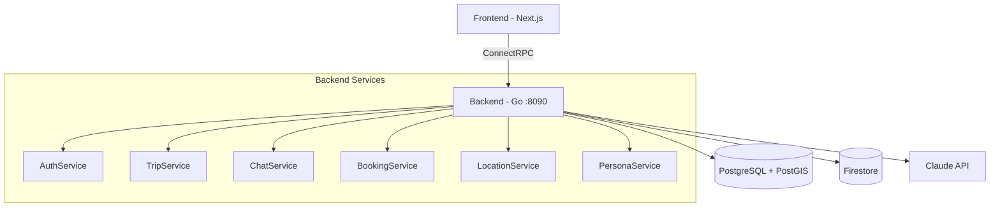
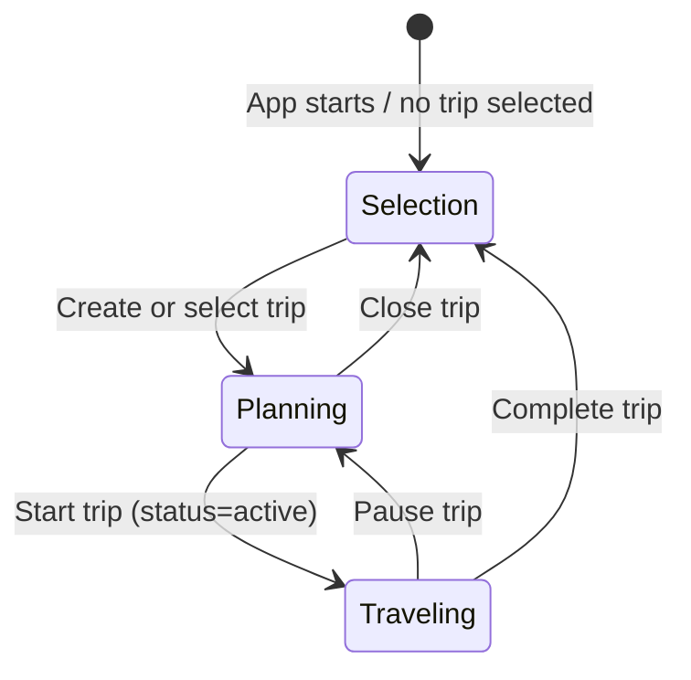
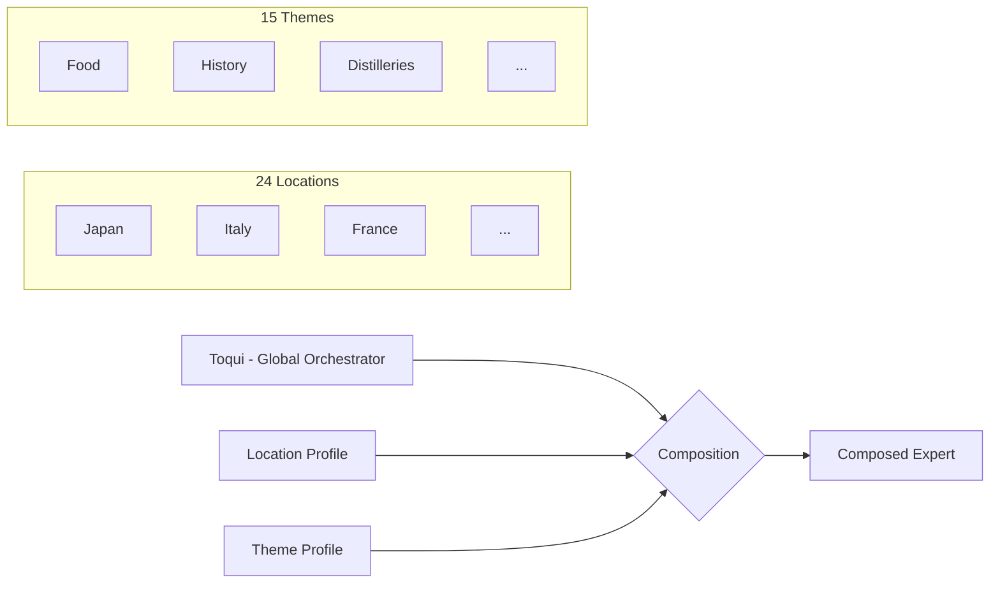

# Toqui Backend

AI-powered travel companion platform. Go backend with ConnectRPC, PostgreSQL, Firestore, and Claude/OpenAI.

## Project Structure

This is a 4-repo project under `github.com/gallowaysoftware`:
- **toqui-backend** (this repo) — Go backend, gRPC API, AI orchestration
- **toqui** — Next.js TypeScript web frontend
- **toqui-terraform** — Terraform GCP infrastructure (staging + prod)
- **toqui-site** — Astro static marketing site

## Architecture



### Key Packages

| Package | Purpose |
|---------|---------|
| `cmd/server` | Main API server entry point |
| `cmd/migrate` | Database migration runner |
| `internal/handlers/` | ConnectRPC service handlers (auth, trip, chat, booking, location, persona) |
| `internal/chat/` | Chat service — AI streaming, tool execution, persona resolution |
| `internal/persona/` | Persona composition — 24 locations × 15 themes = 360 expert combos |
| `internal/ai/` | AI provider abstraction (Claude primary, OpenAI fallback) |
| `internal/ai/tools/` | LLM-callable tool registry (WebSearch, Places) |
| `internal/chatstore/` | Firestore chat message persistence |
| `internal/lifecycle/` | GDPR deletion, archival, data export |
| `internal/auth/` | Google OAuth + JWT + auth interceptor |
| `internal/trip/` | Trip CRUD, status transitions, destination management |
| `internal/booking/` | Booking ingestion + AI parsing (email, paste, manual) |
| `internal/location/` | Location service — ephemeral location, nearby places (Google Places) |
| `internal/theme/` | Trip theme tagging (AI-driven classification) |
| `internal/config/` | Three-layer config: env file → os.Getenv → GCP Secret Manager |
| `internal/db/` | PostgreSQL connection pool + transaction helpers |
| `internal/validate/` | ConnectRPC interceptor for buf.validate constraints |
| `internal/ratelimit/` | Per-user rate limiting interceptor (token bucket, AI vs general) |
| `internal/aitest/` | AI integration test harness (build tag: `aitest`) |
| `internal/integration/` | Integration test suite (build tag: `integration`) |
| `internal/dbgen/` | Generated sqlc query code (regenerate: `make sqlc`) |
| `proto/toqui/v1/` | Protobuf service definitions (7 files, 6 services, 28 RPCs) |
| `gen/toqui/v1/` | Generated Go proto code (regenerate: `make proto`) |

### Services (proto/toqui/v1/)

- **AuthService** — Google OAuth, JWT refresh, account deletion/export
- **TripService** — Trip CRUD, itinerary management
- **ChatService** — Streaming chat with AI, history, sessions
- **BookingService** — Booking ingestion (AI parsing), CRUD
- **PersonaService** — List/resolve/set default persona
- **LocationService** — Ephemeral location updates, nearby places

## Conventions

- **Logging**: Use `log/slog` for all Go logging. Structured key-value pairs, not `log.Printf` or `fmt.Printf`.
- **Imports**: Alias proto types as `toquiv1`, connect stubs as `toquiv1connect`.
- **ConnectRPC routes**: `/toqui.v1.ServiceName/MethodName`
- **Firestore paths**: `users/{uid}/trips/{tripId}/chatSessions/{sessionId}/messages`
- **SQL**: Use `sqlc.arg(name)` named parameters (not positional `$N`) for COALESCE-heavy queries.

## Request Pipeline

Every ConnectRPC request passes through the interceptor chain:

```
Request → validate.Interceptor → auth.Interceptor → ratelimit.Interceptor → Handler
```

- **validate**: Enforces `buf.validate` constraints on request protos (string lengths, UUID format, lat/lng bounds). Returns `InvalidArgument` on failure.
- **auth**: Extracts JWT from `Authorization` header, validates, injects user ID into context. Returns `Unauthenticated` on failure.
- **ratelimit**: Per-user token bucket. Separate limits for AI RPCs (SendMessage) vs general RPCs. Returns `ResourceExhausted` when exceeded.

## Development

```bash
make run              # Run server (local, default)
make run-staging      # Run locally against staging infrastructure
make run-prod         # Run locally against prod infrastructure
make build            # Build server binary
make test             # Run unit tests
make lint             # Run golangci-lint
make proto            # Generate Go proto code + lint
make sqlc             # Generate Go from SQL queries
make docker-up        # Start Postgres + Firestore emulator
make docker-down      # Tear down
```

TS proto bindings are generated in the frontend repo (`pnpm generate` in `../toqui`).

### CI

GitHub Actions on push to `main` and all PRs (self-hosted Linux runners):
- **toqui-backend**: build → vet → test with coverage → PR coverage comment
- **toqui**: install → lint → build
- **toqui-site**: install → build

### Task Tracking

All task tracking is in GitHub Issues: [toqui-backend issues](https://github.com/gallowaysoftware/toqui-backend/issues), [toqui issues](https://github.com/gallowaysoftware/toqui/issues). Labels: `P1`, `P2`, `backend`, `frontend`, `infra`, `staging-launch`.

### Database

PostgreSQL 16 + PostGIS. Migrations in `db/migrations/`, queries in `db/queries/`.

```bash
make migrate-up     # Apply migrations
make migrate-down   # Rollback one
make migrate-create # Create new migration files
```

### Environment Configuration

Config loads in three layers via `internal/config/`:
1. **Env file**: `env/.env.{TARGET_ENV}` parsed, sets missing env vars (no overwrite)
2. **os.Getenv with defaults**: Same as before, sane local defaults
3. **Secret Manager resolution**: `gcsm://` prefixed values replaced by GCP Secret Manager fetch

```bash
make run                                            # TARGET_ENV=local (default)
TARGET_ENV=staging make run                         # Uses staging infra + secrets
FIRESTORE_EMULATOR_HOST=localhost:8080 TARGET_ENV=staging make run  # Hybrid: staging DB, local Firestore
```

Env files: `env/.env.local`, `env/.env.staging`, `env/.env.prod`. Staging/prod use `gcsm://secret-name` references resolved at startup (requires `gcloud auth application-default login`).

Required: `GOOGLE_CLIENT_ID`, `GOOGLE_CLIENT_SECRET`, `ANTHROPIC_API_KEY` (or `OPENAI_API_KEY`). See `env/.env.local` for the full local dev config.

## Trip Mode System



- **Selection mode** — No trip selected. Chat-first interface: user describes what they want, AI creates or selects trips via tools (`create_trip`, `select_trip`). The AI matches vague references ("my Greece trip") to existing trips.
- **Planning mode** — Trip selected, `status=planning`. Talk to personas, build itinerary, add bookings. AI has full trip context (title, description, destination, themes) injected as system context.
- **Companion mode** — Trip started, `status=active`. Location-aware responses. The AI knows you're traveling (not just planning) which changes how personas respond.

## Persona System



Toqui (the global orchestrator) hands off to composed experts. Each expert is dynamically built from a location profile + theme profile(s). Persona identities (names, descriptions, greetings) are AI-generated and cached for consistency.

**24 locations**: IT, JP, FR, GB, US, ES, DE, PT, GR, TH, MX, AU, BR, IN, KR, VN, MA, PE, NZ, TR, HR, ZA, CO, EG (4 core in `profiles.go`, 20 extended in `profiles_extended.go`).

**15 themes**: food, history, distilleries, adventure, wellness, wine, architecture, nightlife, shopping, family, photography, nature, romance, budget, luxury (3 core, 12 extended).

## Chat Tool System

The AI in chat mode has access to tools injected by the handler layer. Tools are mode-specific and follow a callback pattern for emitting stream events to the frontend.

### Available Chat Tools

| Tool | Modes | What it does | Stream Event |
|------|-------|-------------|--------------|
| `create_trip` | selection | AI creates a new trip when user describes travel plans | `TripCreated` |
| `select_trip` | selection | AI matches vague references to existing trips | `TripSelected` |
| `create_itinerary_items` | planning | AI adds structured day-by-day itinerary items | `ItineraryUpdate` |
| `suggest_expert` | all modes | Toqui hands off to a composed expert persona | `PersonaSwitch` |
| `web_search` | all modes | Search the web for current info (global tool registry) | — |
| `place_lookup` | all modes | Google Places API lookup (global tool registry) | — |

### Adding a New Chat Tool

Follow the pattern in `internal/handlers/tool_create_itinerary.go`:

1. **Create** `internal/handlers/tool_<name>.go` implementing `tools.Tool` interface:
   - `Definition() ai.ToolDefinition` — name, description, JSON Schema parameters
   - `Execute(ctx, args) (json.RawMessage, error)` — business logic + callback
2. **Wire** the tool in `internal/handlers/chat.go` `SendMessage()`:
   - Create a mutex-protected callback to collect results
   - Instantiate the tool with service dependencies + callback
   - Append to `params.ExtraTools`
3. **Emit** the stream event in the `tool_result` handler block in `chat.go`
4. **Write tests**:
   - Unit tests in `internal/handlers/tool_<name>_test.go` (arg parsing, edge cases)
   - Integration test in `internal/integration/` (DB operations with real Postgres)
   - AI scenario in `internal/aitest/` (end-to-end with real LLM)
5. **Update** system prompt in the relevant mode (e.g., `buildTripContext()` for planning)
6. **Update** this CLAUDE.md doc and the aitest scenario table

### Tool Injection Pattern

```
ChatHandler.SendMessage()
  ├── Create mutex + callback slices
  ├── Instantiate tools with service deps + callbacks
  ├── params.ExtraTools = [tool1, tool2, ...]
  ├── chatSvc.SendMessage(params) → eventCh
  └── for event := range eventCh:
        case "tool_result":
          mu.Lock()
          if event.ToolName == "my_tool" && len(collected) > 0:
            stream.Send(MyProtoEvent{...})
          mu.Unlock()
```

## Feature Implementation Checklist

Every new feature must include all of the following. Do not merge without completing each item:

1. **Implementation** — The feature code itself
2. **Unit tests** — In the same package (`*_test.go`), test arg parsing, edge cases, error handling
3. **Integration tests** — In `internal/integration/` (build tag `integration`), test DB operations with real Postgres via docker-compose
4. **AI integration test enhancement** — In `internal/aitest/`, either:
   - Add a new regression scenario (if the feature is significant enough)
   - Or extend an existing scenario with new steps/assertions that exercise the feature
5. **Documentation** — Update CLAUDE.md with the feature (tool table, scenario table, any new patterns)
6. **Commit + push** — All of the above in one commit

### Testing Approach

- **Unit tests**: No DB required. Test JSON parsing, validation, error paths. Use `persona.NewComposer(nil)` for template-based persona tests.
- **Integration tests**: Real Postgres via `docker compose up -d`. Build tag `integration`. Use `TestEnv.CleanDB()` for isolation.
- **AI tests**: Real LLM calls via `docker compose up -d` + API key. Build tag `aitest`. Each scenario gets an isolated test user. Structural assertions are hard failures; LLM evaluations are informational.

## AI Integration Tests

End-to-end test harness that exercises the full trip lifecycle through the AI. Uses real LLM calls.

```bash
docker compose up -d                    # Start Postgres + Firestore emulator
make ai-test                            # Run regression scenarios
make ai-test-generative                 # Run regression + LLM-generated scenarios
go test -tags=aitest -v -timeout=30m \
  ./internal/aitest/... -run TestAIScenarios/alice  # Run specific scenario
```

### Regression Scenarios

| Scenario | What it tests |
|----------|---------------|
| `alice-backpacker-lifecycle` | Full lifecycle: selection → planning → companion → complete |
| `bob-family-planner` | Planning context injection — AI must know destination without asking |
| `carol-returning-user` | Multi-trip: select_trip matching, trip switching, new trip creation |
| `update-regression` | UpdateTrip COALESCE — status change must not wipe title/description |
| `dave-itinerary-and-handoff` | create_itinerary_items tool usage + suggest_expert persona handoff |

### Design

- **Structural assertions are hard failures** (tool called, response contains, trip status) — these fail the test.
- **LLM evaluations are informational** (response quality scored 1-5 by a judge LLM) — these log warnings but don't fail.
- Each scenario gets its own isolated test user.
- Reports written to `testdata/aitest-reports/` as JSON.

## Infrastructure

GCP infrastructure is managed in the [toqui-terraform](https://github.com/gallowaysoftware/toqui-terraform) repo.

**Two GCP projects** under the Toqui folder in the `thegalloways.ca` org:
- **toqui-staging** — GCE VM + Docker + Tailscale VPN (no public access), Cloud SQL `db-f1-micro`
- **toqui-prod** — Cloud Run (public), Cloud SQL with HA + backups

Both use Cloud SQL PostgreSQL 16 (private IP), Firestore (native mode), Secret Manager, and Artifact Registry.

### Deploying to Staging

```bash
# Build and push image
docker build -t us-central1-docker.pkg.dev/toqui-staging/toqui-backend/toqui-backend:latest .
docker push us-central1-docker.pkg.dev/toqui-staging/toqui-backend/toqui-backend:latest

# Pull and restart on the VM
gcloud compute ssh toqui-staging-vm --tunnel-through-iap --project=toqui-staging -- \
  'docker pull us-central1-docker.pkg.dev/toqui-staging/toqui-backend/toqui-backend:latest && docker restart toqui-backend'

# Run migrations if needed
gcloud compute ssh toqui-staging-vm --tunnel-through-iap --project=toqui-staging -- \
  'docker exec toqui-backend /migrate -dir /migrations -db "$(cat /etc/toqui/database-url)" up'
```

Staging is accessible at `toqui-staging:8090` via Tailscale VPN. SSH via `gcloud compute ssh toqui-staging-vm --tunnel-through-iap --project=toqui-staging`.

## Auth Flow

Google OAuth → backend callback → set temporary HttpOnly cookie → redirect to frontend → frontend calls `POST /auth/exchange` (with `credentials: include`) → backend returns tokens in response body + clears cookie → frontend stores tokens in memory and uses `Authorization: Bearer` for all subsequent API calls.

HTTP routes (outside ConnectRPC):
- `GET /auth/google/login` — Initiates OAuth, sets state cookie, redirects to Google
- `GET /auth/google/callback` — Exchanges code, sets `toqui_oauth_result` cookie (60s TTL), redirects to frontend `/auth/callback`
- `POST /auth/exchange` — Reads cookie, returns `{access_token, refresh_token, user_id, email, name}` as JSON, clears cookie (one-time use)

## Data Lifecycle

- **Location data**: Ephemeral (request-scoped only, never stored)
- **Trip archival**: 90 days after completion, chat messages purged from Firestore
- **User deletion**: GDPR Article 17 — CASCADE deletes in Postgres + Firestore purge, within 30 days
- **Data export**: GDPR Article 20 — async job generates downloadable archive
