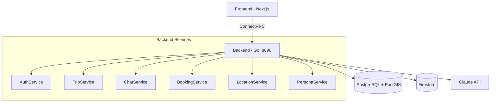
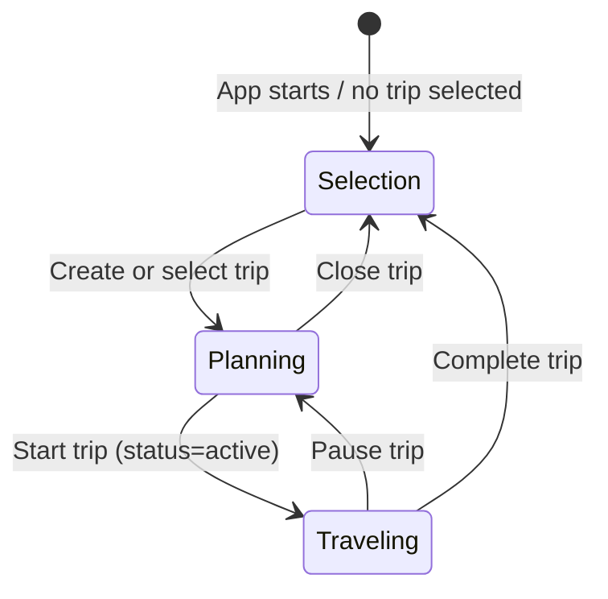

# Toqui Backend

AI-powered travel companion platform. Go backend with ConnectRPC, PostgreSQL, Firestore, and Claude/OpenAI.

## Project Structure

This is a 3-repo project under `github.com/gallowaysoftware`:
- **toqui-backend** (this repo) — Go backend, gRPC API, AI orchestration
- **toqui** — Next.js TypeScript web frontend
- **toqui-site** — Astro static marketing site

## Architecture



### Key Packages

| Package | Purpose |
|---------|---------|
| `cmd/server` | Main API server entry point |
| `cmd/migrate` | Database migration runner |
| `internal/handlers/` | ConnectRPC service handlers (auth, trip, chat, booking, location, persona) |
| `internal/chat/` | Chat service — AI streaming, tool execution, persona resolution |
| `internal/persona/` | Persona composition — 20 locations × 15 themes = 300 expert combos |
| `internal/ai/` | AI provider abstraction (Claude primary, OpenAI fallback) |
| `internal/ai/tools/` | LLM-callable tool registry (WebSearch, Places) |
| `internal/chatstore/` | Firestore chat message persistence |
| `internal/lifecycle/` | GDPR deletion, archival, data export |
| `internal/auth/` | Google OAuth + JWT + auth interceptor |
| `internal/trip/` | Trip CRUD, status transitions, destination management |
| `internal/booking/` | Booking ingestion + AI parsing (email, paste, manual) |
| `internal/location/` | Location service — ephemeral location, nearby places (Google Places) |
| `internal/theme/` | Trip theme tagging (AI-driven classification) |
| `internal/config/` | Three-layer config: env file → os.Getenv → GCP Secret Manager |
| `internal/db/` | PostgreSQL connection pool + transaction helpers |
| `internal/validate/` | ConnectRPC interceptor for buf.validate constraints |
| `internal/ratelimit/` | Per-user rate limiting interceptor (token bucket, AI vs general) |
| `internal/aitest/` | AI integration test harness (build tag: `aitest`) |
| `internal/integration/` | Integration test suite (build tag: `integration`) |
| `internal/dbgen/` | Generated sqlc query code (gitignored) |
| `proto/toqui/v1/` | Protobuf service definitions (7 files, 6 services, 30+ RPCs) |
| `gen/toqui/v1/` | Generated Go proto code (gitignored) |

### Services (proto/toqui/v1/)

- **AuthService** — Google OAuth, JWT refresh, account deletion/export
- **TripService** — Trip CRUD, itinerary management
- **ChatService** — Streaming chat with AI, history, sessions
- **BookingService** — Booking ingestion (AI parsing), CRUD
- **PersonaService** — List/resolve/set default persona
- **LocationService** — Ephemeral location updates, nearby places

## Conventions

- **Logging**: Use `log/slog` for all Go logging. Structured key-value pairs, not `log.Printf` or `fmt.Printf`.
- **Imports**: Alias proto types as `toquiv1`, connect stubs as `toquiv1connect`.
- **ConnectRPC routes**: `/toqui.v1.ServiceName/MethodName`
- **Firestore paths**: `users/{uid}/trips/{tripId}/chatSessions/{sessionId}/messages`
- **SQL**: Use `sqlc.arg(name)` named parameters (not positional `$N`) for COALESCE-heavy queries.

## Request Pipeline

Every ConnectRPC request passes through the interceptor chain:

```
Request → validate.Interceptor → auth.Interceptor → ratelimit.Interceptor → Handler
```

- **validate**: Enforces `buf.validate` constraints on request protos (string lengths, UUID format, lat/lng bounds). Returns `InvalidArgument` on failure.
- **auth**: Extracts JWT from `Authorization` header, validates, injects user ID into context. Returns `Unauthenticated` on failure.
- **ratelimit**: Per-user token bucket. Separate limits for AI RPCs (SendMessage) vs general RPCs. Returns `ResourceExhausted` when exceeded.

## Development

```bash
make run              # Run server (local, default)
make run-staging      # Run locally against staging infrastructure
make run-prod         # Run locally against prod infrastructure
make build            # Build server binary
make test             # Run unit tests
make lint             # Run golangci-lint
make proto            # Generate Go proto code + lint
make sqlc             # Generate Go from SQL queries
make docker-up        # Start Postgres + Firestore emulator
make docker-down      # Tear down
```

TS proto bindings are generated in the frontend repo (`pnpm generate` in `../toqui`).

### Database

PostgreSQL 16 + PostGIS. Migrations in `db/migrations/`, queries in `db/queries/`.

```bash
make migrate-up     # Apply migrations
make migrate-down   # Rollback one
make migrate-create # Create new migration files
```

### Environment Configuration

Config loads in three layers via `internal/config/`:
1. **Env file**: `env/.env.{TARGET_ENV}` parsed, sets missing env vars (no overwrite)
2. **os.Getenv with defaults**: Same as before, sane local defaults
3. **Secret Manager resolution**: `gcsm://` prefixed values replaced by GCP Secret Manager fetch

```bash
make run                                            # TARGET_ENV=local (default)
TARGET_ENV=staging make run                         # Uses staging infra + secrets
FIRESTORE_EMULATOR_HOST=localhost:8080 TARGET_ENV=staging make run  # Hybrid: staging DB, local Firestore
```

Env files: `env/.env.local`, `env/.env.staging`, `env/.env.prod`. Staging/prod use `gcsm://secret-name` references resolved at startup (requires `gcloud auth application-default login`).

Required: `GOOGLE_CLIENT_ID`, `GOOGLE_CLIENT_SECRET`, `ANTHROPIC_API_KEY` (or `OPENAI_API_KEY`). See `env/.env.local` for the full local dev config.

## Trip Mode System



- **Selection mode** — No trip selected. Chat-first interface: user describes what they want, AI creates or selects trips via tools (`create_trip`, `select_trip`). The AI matches vague references ("my Greece trip") to existing trips.
- **Planning mode** — Trip selected, `status=planning`. Talk to personas, build itinerary, add bookings. AI has full trip context (title, description, destination, themes) injected as system context.
- **Companion mode** — Trip started, `status=active`. Location-aware responses. The AI knows you're traveling (not just planning) which changes how personas respond.

## Persona System


Toqui (the global orchestrator) hands off to composed experts. Each expert is dynamically built from a location profile + theme profile(s). Persona identities (names, descriptions, greetings) are AI-generated and cached for consistency.

**20 locations**: IT, JP, FR, GB, US, ES, DE, PT, GR, TH, MX, AU, BR, IN, KR, VN, MA, PE, NZ, TR, HR, ZA, CO, EG (4 core in `profiles.go`, 16 extended in `profiles_extended.go`).

**15 themes**: food, history, distilleries, adventure, wellness, wine, architecture, nightlife, shopping, family, photography, nature, romance, budget, luxury (3 core, 12 extended).

## AI Integration Tests

End-to-end test harness that exercises the full trip lifecycle through the AI. Uses real LLM calls.

```bash
docker compose up -d                    # Start Postgres + Firestore emulator
make ai-test                            # Run regression scenarios
make ai-test-generative                 # Run regression + LLM-generated scenarios
go test -tags=aitest -v -timeout=30m \
  ./internal/aitest/... -run TestAIScenarios/alice  # Run specific scenario
```

### Regression Scenarios

| Scenario | What it tests |
|----------|---------------|
| `alice-backpacker-lifecycle` | Full lifecycle: selection → planning → companion → complete |
| `bob-family-planner` | Planning context injection — AI must know destination without asking |
| `carol-returning-user` | Multi-trip: select_trip matching, trip switching, new trip creation |
| `update-regression` | UpdateTrip COALESCE — status change must not wipe title/description |

### Design

- **Structural assertions are hard failures** (tool called, response contains, trip status) — these fail the test.
- **LLM evaluations are informational** (response quality scored 1-5 by a judge LLM) — these log warnings but don't fail.
- Each scenario gets its own isolated test user.
- Reports written to `testdata/aitest-reports/` as JSON.

## Auth Flow

**TODO: Replace token-in-URL redirect with secure cookies + cookie auth middleware + GetTokens RPC.**

Current flow: Google OAuth -> backend callback -> redirect to frontend with tokens in URL params.
Target flow: Google OAuth -> backend callback -> set secure HttpOnly cookie -> frontend calls GetTokens RPC with cookie.

## Data Lifecycle

- **Location data**: Ephemeral (request-scoped only, never stored)
- **Trip archival**: 90 days after completion, chat messages purged from Firestore
- **User deletion**: GDPR Article 17 — CASCADE deletes in Postgres + Firestore purge, within 30 days
- **Data export**: GDPR Article 20 — async job generates downloadable archive
