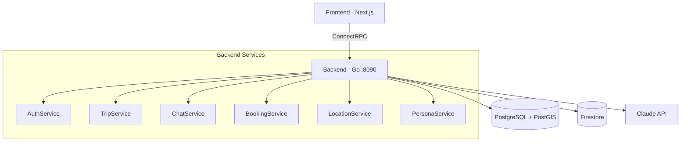
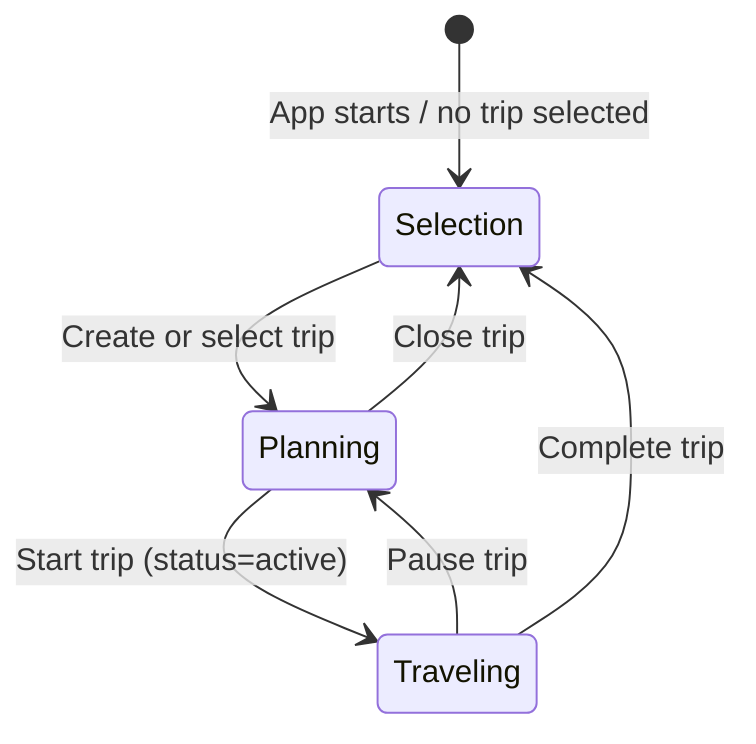

# Toqui Backend

AI-powered travel companion platform. Go backend with ConnectRPC, PostgreSQL, Firestore, and Claude/Gemini.

## Project Structure

This is a 4-repo project under `github.com/gallowaysoftware`:

- **toqui-backend** (this repo) — Go backend, gRPC API, AI orchestration
- **toqui** — Next.js TypeScript web frontend
- **toqui-terraform** — Terraform GCP infrastructure (staging + prod)
- **toqui-site** — Astro static marketing site

## Architecture



### Key Packages

| Package                 | Purpose                                                                                   |
| ----------------------- | ----------------------------------------------------------------------------------------- |
| `cmd/server`            | Main API server entry point                                                               |
| `cmd/migrate`           | Database migration runner                                                                 |
| `internal/handlers/`    | ConnectRPC service handlers (auth, trip, chat, booking, location, persona)                |
| `internal/chat/`        | Chat service — AI streaming, tool execution, persona resolution                           |
| `internal/persona/`     | Persona composition — 40 locations × 20 themes = 800 expert combos                        |
| `internal/ai/`          | AI provider abstraction (Claude primary, Gemini/Vertex AI fallback)                       |
| `internal/ai/tools/`    | LLM-callable tool registry (WebSearch, Places)                                            |
| `internal/chatstore/`   | Firestore chat message persistence                                                        |
| `internal/lifecycle/`   | GDPR deletion, archival, data export                                                      |
| `internal/auth/`        | Google OAuth + JWT + auth interceptor + refresh token rotation (JTI/family tracking)      |
| `internal/trip/`        | Trip CRUD, status transitions, destination management                                     |
| `internal/booking/`     | Booking ingestion + AI parsing (email, paste, manual)                                     |
| `internal/location/`    | Location service — ephemeral location cache (30 min TTL), nearby places (Google Places)   |
| `internal/theme/`       | Trip theme tagging (AI-driven classification)                                             |
| `internal/affiliate/`   | Affiliate link builder — generates partner URLs for Skyscanner, Booking.com, GetYourGuide |
| `internal/config/`      | Three-layer config: env file → os.Getenv → GCP Secret Manager                             |
| `internal/db/`          | PostgreSQL connection pool + transaction helpers                                          |
| `internal/validate/`    | ConnectRPC interceptor for buf.validate constraints                                       |
| `internal/csrf/`        | CSRF protection middleware (Origin/Referer validation for state-changing requests)        |
| `internal/audit/`       | Structured audit logging for security-relevant events (via slog → Cloud Logging)         |
| `internal/ratelimit/`   | Per-user rate limiting interceptor + per-IP auth lockout (AuthLimiter)                    |
| `internal/usage/`       | Daily usage tracking + message limit enforcement per user                                 |
| `internal/aitest/`      | AI integration test harness (build tag: `aitest`)                                         |
| `internal/integration/` | Integration test suite (build tag: `integration`)                                         |
| `internal/dbgen/`       | Generated sqlc query code (regenerate: `make sqlc`)                                       |
| `proto/toqui/v1/`       | Protobuf service definitions (7 files, 6 services, 28 RPCs)                               |
| `gen/toqui/v1/`         | Generated Go proto code (regenerate: `make proto`)                                        |

### Services (proto/toqui/v1/)

- **AuthService** — Google OAuth, JWT refresh, account deletion/export
- **TripService** — Trip CRUD, itinerary management
- **ChatService** — Streaming chat with AI, history, sessions
- **BookingService** — Booking ingestion (AI parsing), CRUD
- **PersonaService** — List/resolve/set default persona
- **LocationService** — Ephemeral location updates, nearby places

## Conventions

- **Logging**: Use `log/slog` for all Go logging. Structured key-value pairs, not `log.Printf` or `fmt.Printf`.
- **Imports**: Alias proto types as `toquiv1`, connect stubs as `toquiv1connect`.
- **ConnectRPC routes**: `/toqui.v1.ServiceName/MethodName`
- **Firestore paths**: `users/{uid}/trips/{tripId}/chatSessions/{sessionId}/messages`
- **SQL**: Use `sqlc.arg(name)` named parameters (not positional `$N`) for COALESCE-heavy queries.

## Request Pipeline

Every ConnectRPC request passes through the interceptor chain:

```
Request → validate.Interceptor → auth.Interceptor → ratelimit.Interceptor → Handler
```

- **validate**: Enforces `buf.validate` constraints on request protos (string lengths, UUID format, lat/lng bounds). Returns `InvalidArgument` on failure.
- **auth**: Extracts JWT from `Authorization` header, validates, injects user ID into context. Returns `Unauthenticated` on failure.
- **ratelimit**: Per-user token bucket. Separate limits for AI RPCs (SendMessage) vs general RPCs. Returns `ResourceExhausted` when exceeded.

## Development

```bash
make run              # Run server (local, default)
make run-staging      # Run locally against staging infrastructure
make run-prod         # Run locally against prod infrastructure
make build            # Build server binary
make test             # Run unit tests
make lint             # Run golangci-lint
make proto            # Generate Go proto code + lint
make sqlc             # Generate Go from SQL queries
make docker-up        # Start Postgres + Firestore emulator
make docker-down      # Tear down
```

TS proto bindings are generated in the frontend repo (`pnpm generate` in `../toqui`).

### CI/CD

GitHub Actions on push to `main` and all PRs (GitHub-hosted runners, `ubuntu-latest`):

- **toqui-backend**: lint, test (with coverage), build run in parallel → **deploy to staging** (main only, Cloud Run)
- **toqui**: lint+typecheck, test, build run in parallel → **deploy to staging** (main only, Cloud Run)
- **toqui-site**: install → build

**Staging auto-deploy**: Push to `main` triggers a `deploy-staging` job that builds a Docker image, pushes to Artifact Registry, deploys to Cloud Run via `gcloud run deploy`, and runs migrations via Cloud Run Jobs. Uses Workload Identity Federation (keyless GCP auth).

### Task Tracking

All task tracking is in GitHub Issues: [toqui-backend issues](https://github.com/gallowaysoftware/toqui-backend/issues), [toqui issues](https://github.com/gallowaysoftware/toqui/issues). Labels: `P0`, `P1`, `P2`, `backend`, `frontend`, `infra`, `staging-launch`, `security`, `code-quality`, `design`, `compliance`.

### Database

PostgreSQL 16 + PostGIS. Migrations in `db/migrations/`, queries in `db/queries/`.

```bash
make migrate-up     # Apply migrations
make migrate-down   # Rollback one
make migrate-create # Create new migration files
```

### Environment Configuration

Config loads in three layers via `internal/config/`:

1. **Env file**: `env/.env.{TARGET_ENV}` parsed, sets missing env vars (no overwrite)
2. **os.Getenv with defaults**: Same as before, sane local defaults
3. **Secret Manager resolution**: `gcsm://` prefixed values replaced by GCP Secret Manager fetch

```bash
make run                                            # TARGET_ENV=local (default)
TARGET_ENV=staging make run                         # Uses staging infra + secrets
FIRESTORE_EMULATOR_HOST=localhost:8080 TARGET_ENV=staging make run  # Hybrid: staging DB, local Firestore
```

Env files: `env/.env.local`, `env/.env.staging`, `env/.env.prod`. All environments use `gcsm://secret-name` references resolved at startup via GCP Secret Manager (requires `gcloud auth application-default login`).

Required: `GOOGLE_CLIENT_ID`, `GOOGLE_CLIENT_SECRET`, `ANTHROPIC_API_KEY` (or `VERTEX_AI_PROJECT_ID` for Gemini fallback). See `env/.env.local` for the full local dev config.

## Trip Mode System



- **Selection mode** — No trip selected. Chat-first interface: user describes what they want, AI creates or selects trips via tools (`create_trip`, `select_trip`). The AI matches vague references ("my Greece trip") to existing trips.
- **Planning mode** — Trip selected, `status=planning`. Talk to personas, build itinerary, add bookings. AI has full trip context (title, description, destination, themes) injected as system context.
- **Companion mode** — Trip started, `status=active`. Location-aware responses. The AI knows you're traveling (not just planning) which changes how personas respond.

## Persona System


Toqui (the global orchestrator) hands off to composed experts. Each expert is dynamically built from a location profile + theme profile(s). Persona identities (names, descriptions, greetings) are AI-generated and cached for consistency.

**40 locations**: IT, JP, FR, GB, US, ES, DE, PT, GR, TH, MX, AU, BR, IN, KR, VN, MA, PE, NZ, TR, HR, ZA, CO, EG, ID, PH, CN, CZ, AT, CH, IE, SE, AR, CL, JO, TZ, IS, SG, HK, KH (4 core in `profiles.go`, 36 extended in `profiles_extended.go`).

**20 themes**: food, history, distilleries, adventure, wellness, wine, architecture, nightlife, shopping, family, photography, nature, romance, budget, luxury, art, music, craft-beer, diving, hiking (3 core, 17 extended).

## Chat Tool System

The AI in chat mode has access to tools injected by the handler layer. Tools are mode-specific and follow a callback pattern for emitting stream events to the frontend.

### Available Chat Tools

| Tool                     | Modes     | What it does                                                                                                                                           | Stream Event           |
| ------------------------ | --------- | ------------------------------------------------------------------------------------------------------------------------------------------------------ | ---------------------- |
| `create_trip`            | selection | AI creates a new trip when user describes travel plans                                                                                                 | `TripCreated`          |
| `select_trip`            | selection | AI matches vague references to existing trips                                                                                                          | `TripSelected`         |
| `create_itinerary_items` | planning  | AI adds structured day-by-day itinerary items                                                                                                          | `ItineraryUpdate`      |
| `suggest_expert`         | all modes | Toqui hands off to a composed expert persona                                                                                                           | `PersonaSwitch`        |
| `recommend_booking`      | all modes | Generate affiliate-linked booking recommendations (flights, hotels, activities). AI sees result via tool loop and includes FTC disclosure in response. | — (inline in response) |
| `nearby_places`          | companion | Find nearby places using user's cached location (location-aware)                                                                                       | —                      |
| `web_search`             | all modes | Search the web for current info (global tool registry)                                                                                                 | —                      |
| `place_lookup`           | all modes | Google Places API lookup (global tool registry)                                                                                                        | —                      |

### Adding a New Chat Tool

Follow the pattern in `internal/handlers/tool_create_itinerary.go`:

1. **Create** `internal/handlers/tool_<name>.go` implementing `tools.Tool` interface:
   - `Definition() ai.ToolDefinition` — name, description, JSON Schema parameters
   - `Execute(ctx, args) (json.RawMessage, error)` — business logic + callback
2. **Wire** the tool in `internal/handlers/chat.go` `SendMessage()`:
   - Create a mutex-protected callback to collect results
   - Instantiate the tool with service dependencies + callback
   - Append to `params.ExtraTools`
3. **Emit** the stream event in the `tool_result` handler block in `chat.go`
4. **Write tests**:
   - Unit tests in `internal/handlers/tool_<name>_test.go` (arg parsing, edge cases)
   - Integration test in `internal/integration/` (DB operations with real Postgres)
   - AI scenario in `internal/aitest/` (end-to-end with real LLM)
5. **Update** system prompt in the relevant mode (e.g., `buildTripContext()` for planning)
6. **Update** this CLAUDE.md doc and the aitest scenario table

### Tool Injection Pattern

```
ChatHandler.SendMessage()
  ├── Create mutex + callback slices
  ├── Instantiate tools with service deps + callbacks
  ├── params.ExtraTools = [tool1, tool2, ...]
  ├── chatSvc.SendMessage(params) → eventCh
  └── for event := range eventCh:
        case "tool_result":
          mu.Lock()
          if event.ToolName == "my_tool" && len(collected) > 0:
            stream.Send(MyProtoEvent{...})
          mu.Unlock()
```

### Tool Call → Result → Continue Loop

The chat service implements an agentic tool loop (`processEventsWithToolLoop` in `internal/chat/service.go`). When the AI makes a tool call:

1. Tool is executed immediately and `tool_call`/`tool_result` events are emitted to the frontend
2. The AI's stop reason is checked — if `"tool_use"`, the tool results are sent back to the AI
3. The AI continues generating with access to the tool results (e.g., including FTC disclosure text from `recommend_booking`)
4. This loops up to `maxToolLoopIterations` (5) until the AI produces a final response (`"end_turn"`)

This is critical for tools like `recommend_booking` where the AI must see the tool result to include disclosure text in its response. Side-effect tools (like `create_trip`, `create_itinerary_items`) also benefit — the AI can confirm what was created.

Both providers parse streaming events to extract stop reasons and serialize tool call/result content blocks for continuation. The Claude provider uses `message_delta` events; the Gemini provider uses `finishReason` in `candidates[]`.

## Pre-Commit Adversarial Review

**MANDATORY**: Before every commit, spawn a parallel adversarial review agent to audit all staged changes. This catches bugs, security issues, and logic errors before they reach the repo.

### How It Works

1. After all implementation and tests are passing, spawn a `general-purpose` Task agent with a prompt like:

   > You are an adversarial code reviewer. Your job is to find bugs, security issues, logic errors, and missing edge cases. Review all changes in these files: [list files]. For each issue found, classify as BLOCKING (must fix before commit) or WARNING (note but can ship). Be thorough and skeptical.

2. The agent reviews all changed files and returns findings classified as:
   - **BLOCKING** — Must fix before commit (bugs, security holes, logic errors, missing validation)
   - **WARNING** — Worth noting but acceptable to ship (style, minor improvements, future work)

3. Fix all BLOCKING issues, then re-run the adversarial review to verify fixes pass.

4. Only commit after the adversarial review returns zero BLOCKING issues.

### What to Review

- All new files and modified files in the changeset
- Test coverage — are edge cases tested?
- Security — input validation, auth checks, injection risks
- Logic — off-by-one errors, race conditions, nil pointer dereferences
- API contracts — do request/response types match proto definitions?
- Error handling — are errors wrapped with context? Are they logged?

## Feature Implementation Checklist

Every new feature must include all of the following. Do not merge without completing each item:

1. **Implementation** — The feature code itself
2. **Unit tests** — In the same package (`*_test.go`), test arg parsing, edge cases, error handling
3. **Integration tests** — In `internal/integration/` (build tag `integration`), test DB operations with real Postgres via docker-compose
4. **AI integration test enhancement** — In `internal/aitest/`, either:
   - Add a new regression scenario (if the feature is significant enough)
   - Or extend an existing scenario with new steps/assertions that exercise the feature
5. **Adversarial review** — Run the pre-commit adversarial review agent (see above)
6. **Documentation** — Update CLAUDE.md with the feature (tool table, scenario table, any new patterns)
7. **Commit + push** — All of the above in one commit

### Testing Approach

- **Unit tests**: No DB required. Test JSON parsing, validation, error paths. Use `persona.NewComposer(nil)` for template-based persona tests.
- **Integration tests**: Real Postgres via `docker compose up -d`. Build tag `integration`. Use `TestEnv.CleanDB()` for isolation.
- **AI tests**: Real LLM calls via `docker compose up -d` + API key. Build tag `aitest`. Each scenario gets an isolated test user. Structural assertions are hard failures; LLM evaluations are informational.

## AI Integration Tests

End-to-end test harness that exercises the full trip lifecycle through the AI. Uses real LLM calls.

```bash
docker compose up -d                    # Start Postgres + Firestore emulator
make ai-test                            # Run regression scenarios
make ai-test-generative                 # Run regression + LLM-generated scenarios
go test -tags=aitest -v -timeout=30m \
  ./internal/aitest/... -run TestAIScenarios/alice  # Run specific scenario
```

### Regression Scenarios

| Scenario                        | What it tests                                                                                               |
| ------------------------------- | ----------------------------------------------------------------------------------------------------------- |
| `alice-backpacker-lifecycle`    | Full lifecycle: selection → planning → companion → complete                                                 |
| `bob-family-planner`            | Planning context injection — AI must know destination without asking                                        |
| `carol-returning-user`          | Multi-trip: select_trip matching, trip switching, new trip creation                                         |
| `update-regression`             | UpdateTrip COALESCE — status change must not wipe title/description                                         |
| `dave-itinerary-and-handoff`    | create_itinerary_items tool usage + suggest_expert persona handoff                                          |
| `eve-expanded-profiles`         | Expanded location/theme profiles (CZ, IS) with craft-beer and hiking expert handoff                         |
| `frank-booking-recommendations` | recommend_booking tool across all categories (flights, hotels, activities) + FTC disclosure + negative test |

### Design

- **Structural assertions are hard failures** (tool called, response contains, trip status) — these fail the test.
- **LLM evaluations are informational** (response quality scored 1-5 by a judge LLM) — these log warnings but don't fail.
- Each scenario gets its own isolated test user.
- Reports written to `testdata/aitest-reports/` as JSON.

## Infrastructure

GCP infrastructure is managed in the [toqui-terraform](https://github.com/gallowaysoftware/toqui-terraform) repo.

**Two GCP projects** under the Toqui folder in the `thegalloways.ca` org:

- **toqui-staging** — Cloud Run (backend + frontend) + Global HTTPS LB + Cloud DNS + managed SSL, Cloud SQL `db-f1-micro`, custom domains (`staging-api.toqui.travel`, `staging-app.toqui.travel`)
- **toqui-prod** — Cloud Run services behind global HTTPS LB, Cloud SQL `db-g1-small`, custom domains (`api.toqui.travel`, `app.toqui.travel`, `toqui.travel`) — Terraform defined, not yet applied

Both use Cloud SQL PostgreSQL 16 (public IP for Cloud Run), Firestore (native mode), Secret Manager, and Artifact Registry.

### Deploying to Staging

**Automatic**: Push to `main` → GitHub Actions builds Docker image, pushes to Artifact Registry, deploys to Cloud Run, runs migrations via Cloud Run Jobs. Uses WIF (keyless GCP auth).

**Manual** (if needed):

```bash
IMAGE=us-central1-docker.pkg.dev/toqui-staging/toqui-backend/toqui-backend

# Build, push, deploy
docker build --platform linux/amd64 -t $IMAGE:latest .
docker push $IMAGE:latest
gcloud run deploy toqui-backend --image=$IMAGE:latest --region=us-central1 --project=toqui-staging

# Run migrations
gcloud run jobs deploy toqui-migrate --image=$IMAGE:latest \
  --region=us-central1 --project=toqui-staging \
  --command=/migrate --args="-direction,up" --execute-now
```

### Rolling Back

```bash
# List available revisions
gcloud run revisions list --service=toqui-backend --region=us-central1 --project=toqui-staging

# Route traffic to previous revision
gcloud run services update-traffic toqui-backend \
  --to-revisions=<previous-revision>=100 --region=us-central1 --project=toqui-staging

# Roll back one database migration
gcloud run jobs deploy toqui-migrate --image=$IMAGE:<previous-sha> \
  --region=us-central1 --project=toqui-staging \
  --command=/migrate --args="-direction,down,-steps,1" --execute-now
```

### Checking Staging Logs

```bash
# Cloud Run logs (real-time)
gcloud run services logs read toqui-backend --region=us-central1 --project=toqui-staging --limit=100

# Or via Cloud Logging
gcloud logging read 'resource.type="cloud_run_revision" AND resource.labels.service_name="toqui-backend"' \
  --project=toqui-staging --limit=50 --format=json
```

Staging is publicly accessible at `https://staging-api.toqui.travel` (backend) and `https://staging-app.toqui.travel` (frontend).

### Docker Image

The Dockerfile produces a distroless image with two binaries:

- `/server` — main API server (entrypoint)
- `/migrate` — database migration runner (auto-detects `/migrations` in Docker, `db/migrations/` locally)

Migrations are copied to `/migrations` in the image. The `cmd/migrate` binary reads `DATABASE_URL` from the environment and uses `golang-migrate`.

## Auth Flow

Google OAuth → backend callback → set temporary HttpOnly cookie → redirect to frontend → frontend calls `POST /auth/exchange` (with `credentials: include`) → backend returns tokens in response body + clears cookie → frontend stores tokens in memory and uses `Authorization: Bearer` for all subsequent API calls.

HTTP routes (outside ConnectRPC):

- `GET /auth/google/login` — Initiates OAuth, sets state cookie, redirects to Google
- `GET /auth/google/callback` — Exchanges code, checks capacity cap, sets `toqui_oauth_result` cookie (60s TTL), redirects to frontend `/auth/callback`
- `POST /auth/exchange` — Reads cookie, returns `{access_token, refresh_token, user_id, email, name}` as JSON, clears cookie (one-time use)
- `POST /waitlist` — Public. JSON body `{"email":"..."}`. Returns `{"position":N}`
- `GET /waitlist/status?email=...` — Public. Returns `{"position":N,"total":M}`
- `GET /api/usage` — Authenticated (Bearer token). Returns `{"used":N,"limit":M,"resets_at":"..."}`

## Security Hardening

### Middleware Chain

```
Request → recovery → requestID → securityHeaders → ipRateLimit → CORS → CSRF → handler
```

- **Recovery**: Panic recovery with structured error logging
- **Request ID**: Generates unique request IDs for tracing
- **Security headers**: `X-Content-Type-Options: nosniff`, `X-Frame-Options: DENY`, `Referrer-Policy: strict-origin-when-cross-origin`, `Permissions-Policy: camera=(), microphone=(), geolocation=()`, `Strict-Transport-Security` (HTTPS only)
- **IP rate limit**: Per-IP request rate limiting (separate from per-user ConnectRPC rate limiting)
- **CORS**: Cross-origin resource sharing for frontend origins
- **CSRF**: Origin/Referer header validation for state-changing requests (POST/PUT/DELETE/PATCH). Exempt: webhooks (have their own ECDSA auth). Non-browser clients (no Origin/Referer) are allowed through.
- **Request body limits**: All REST POST handlers use `http.MaxBytesReader(w, r.Body, 1<<20)` — 1MB max

### JWT Token Types

- **Access tokens**: No `type` claim, 1-hour expiry. Used for `Authorization: Bearer`.
- **Refresh tokens**: `type: "refresh"` claim, 30-day expiry. Only accepted by `ValidateRefreshToken()`.
- **Important**: `ValidateToken()` explicitly rejects tokens with `type == "refresh"` to prevent token type confusion.

### Refresh Token Rotation

Refresh tokens are DB-backed with JTI (JWT ID) and family tracking:

1. **Login** creates a new token family (random UUID). The refresh token's JTI and family are stored in the `refresh_tokens` table.
2. **Refresh** validates the JTI against the database, revokes the used token, and issues a new token in the same family.
3. **Reuse detection**: If a revoked token is presented, the entire family is revoked (breach response). This catches token theft where both the attacker and legitimate user try to use the same token.
4. **Cleanup**: Expired tokens can be purged via `DeleteExpiredRefreshTokens` query.

### Auth Lockout

Per-IP failure tracking via `AuthLimiter` (in `internal/ratelimit/`):

- **5 failed attempts** within a 15-minute window → IP blocked for 15 minutes
- Applied to `POST /auth/exchange` (OAuth) and `RefreshToken` RPC
- Successful auth clears the failure counter
- Background goroutine cleans up stale entries

### Audit Logging

Structured audit events via `internal/audit/` package, written through `slog` for automatic Cloud Logging collection:

- `auth.login`, `auth.login_denied.domain`, `auth.login_denied.capacity`, `auth.login_admitted.invite`
- `auth.token_refresh`, `auth.token_refresh_denied`, `auth.token_reuse_detected`, `auth.lockout`
- `auth.account_delete`, `auth.data_export`
- `trip.share`, `trip.unshare`
- `security.csrf_rejected`

### Cookie Encoding (OAuth)

The `toqui_oauth_result` cookie uses **base64url encoding** (`base64.RawURLEncoding`) because Go's `net/http` silently strips `"` characters from cookie values per RFC 6265. The JSON payload would be corrupted without encoding. The cookie uses `SameSite=None` + `Secure=true` because the frontend (`staging-app`) and backend (`staging-api`) are on different subdomains.

### Security Checklist for New Handlers

When adding new handlers, ensure:

1. **Ownership checks**: All data-access handlers verify `userID` from auth context before returning data
2. **Body limits**: REST POST handlers use `http.MaxBytesReader`
3. **Domain allowlist**: Any new auth paths must check `isEmailDomainAllowed()`
4. **Token type**: Only use `ValidateToken()` for access tokens, `ValidateRefreshToken()` for refresh
5. **JWT enforcement**: Non-local environments fail startup if `JWT_SECRET` is the default
6. **CSRF exempt**: If adding a new webhook endpoint, add its prefix to the CSRF exempt list in `main.go`
7. **Audit logging**: Security-relevant events (auth, data access, sharing) must use `audit.Log()`

### Known Open Security Issues

See [GitHub Issues with `security` label](https://github.com/gallowaysoftware/toqui-backend/issues?q=label:security) for the full list. Key remaining item:

- **H-4** (#57): Auth tokens in localStorage — deferred, requires architectural refactor to HttpOnly cookies

## Waitlist + Capacity Cap

New users are subject to a capacity cap controlled by `MAX_FREE_USERS` (default: 500). When the cap is reached:

- Existing users can still log in (upsert on google_id)
- New users without a valid invite code are redirected to `/waitlist?reason=at_capacity`
- New users with a valid invite code are admitted and their waitlist entry is marked as accepted

Tables: `waitlist` (email, invite_code, signed_up_at, invited_at, accepted_at)

## Daily Usage Limits

Each user is limited to `DAILY_MESSAGE_LIMIT` (default: 30) messages per day across all chat modes. The limit is enforced at the start of `SendMessage` in the chat handler. When exceeded, a `ResourceExhausted` error is returned with the reset time (midnight UTC).

Tables: `daily_usage` (user_id, date, message_count, ai_cost_cents)

## Cost Management

### AI Provider Architecture

**Claude (primary)** — Anthropic API with API key. Set a monthly spend cap in the [Anthropic Console](https://console.anthropic.com) → Settings → Billing → Spend Limits. Recommended: $50/month staging, $500/month prod.

**Gemini (fallback)** — Google Vertex AI with Application Default Credentials (ADC). No API key needed — uses the same `gcloud auth application-default login` as Secret Manager. Billing is per-GCP-project, providing natural environment separation. Requires `aiplatform.googleapis.com` API enabled and `roles/aiplatform.user` IAM role on the calling identity.

| Model Tier | Claude                     | Gemini (Vertex AI)      |
| ---------- | -------------------------- | ----------------------- |
| fast       | `claude-3-5-haiku-latest`  | `gemini-2.5-flash-lite` |
| smart      | `claude-sonnet-4-20250514` | `gemini-2.5-flash`      |
| best       | `claude-sonnet-4-20250514` | `gemini-2.5-pro`        |

Override models via env vars: `AI_MODEL_FAST/SMART/BEST` (Claude), `AI_GEMINI_MODEL_FAST/SMART/BEST` (Gemini).

### Token Usage Tracking

Every AI request logs token usage with environment label via slog:

```
INFO ai request completed provider=gemini env=staging input_tokens=2662 output_tokens=200 total_tokens=2862 tool_loop_iterations=2
```

Token counts are accumulated across tool loop iterations. Usage is parsed from Claude's `message_start`/`message_delta` events and Gemini's `usageMetadata`.

### Cost Controls (implemented)

- **Daily token budget**: `DAILY_AI_TOKEN_BUDGET` — soft limit per environment (default: 0 = unlimited). 1M staging, 5M prod.
- **Prompt caching**: system prompts cached for 5 min (90% cheaper on cache hits, Claude only)
- **Model routing**: simple tasks → fast tier (2048 max tokens), complex → smart tier (8192 max tokens)
- **Daily message limit**: 30 msgs/user/day (configurable via `DAILY_MESSAGE_LIMIT`)
- **Response caching**: popular destination intros cached for 1 hour (configurable via `LLM_CACHE_TTL`)
- **Per-user rate limiting**: 10 requests per 60 seconds via ConnectRPC interceptor
- **GCP project separation**: toqui-staging vs toqui-prod — billing differentiation at the infra level

## Cross-Repo Consistency

**IMPORTANT**: This project spans 4 repos. When making changes that affect shared documentation (architecture, deployment, CI/CD, security patterns, staging/prod status), update CLAUDE.md in ALL repos to keep them consistent:

- `/Users/pequalsnp/src/github.com/gallowaysoftware/toqui-backend/CLAUDE.md` (this file)
- `/Users/pequalsnp/src/github.com/gallowaysoftware/toqui/CLAUDE.md`
- `/Users/pequalsnp/src/github.com/gallowaysoftware/toqui-terraform/CLAUDE.md`
- `/Users/pequalsnp/src/github.com/gallowaysoftware/toqui-site/CLAUDE.md`

Also update the shared memory file: `/Users/pequalsnp/.claude/projects/-Users-pequalsnp-src-github-com-pequalsnp-travelchat-backend/memory/MEMORY.md`

## Data Lifecycle

- **Location data**: Ephemeral in-memory cache (30 min TTL), never persisted to database
- **Trip archival**: 90 days after completion, chat messages purged from Firestore
- **User deletion**: GDPR Article 17 — CASCADE deletes in Postgres + Firestore purge, within 30 days
- **Data export**: GDPR Article 20 — async job generates downloadable archive
