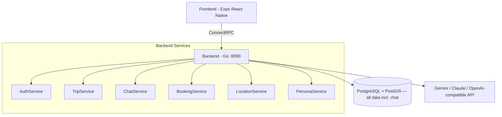
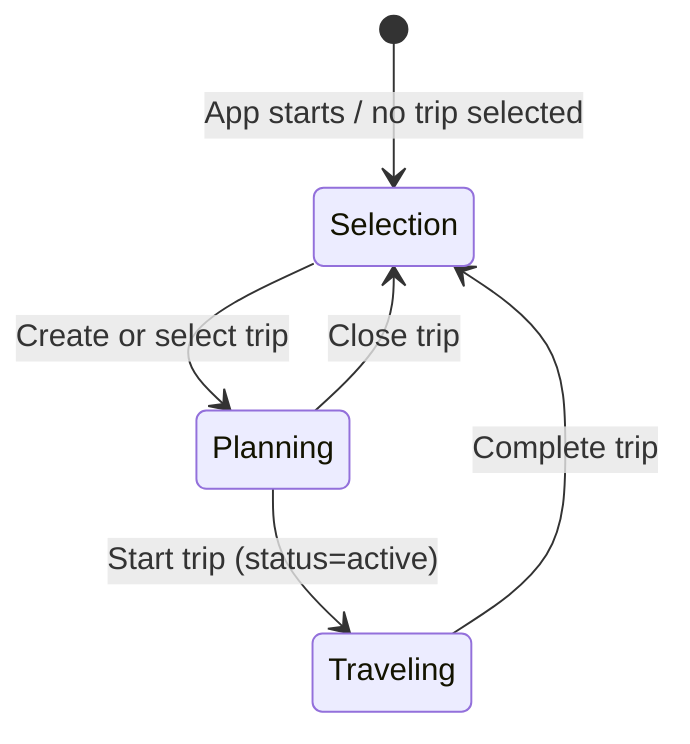

# Toqui Backend

AI-powered travel companion. Go backend with ConnectRPC, PostgreSQL + PostGIS, and a pluggable AI provider layer (Gemini / Claude / any OpenAI-compatible endpoint). Self-hostable OSS under AGPL-3.0-or-later — the hosted SaaS is being wound down.

## Core Principles

### User Privacy — Non-Negotiable

Toqui exists to help travelers, not to exploit them. These rules are absolute and override any business or feature consideration:

**Data Collection:**
- Collect only what's needed to deliver the feature. If in doubt, don't collect it.
- Travel data is inherently sensitive — destinations can reveal religion, health conditions, sexuality, and political activity. Treat ALL travel data as potentially sensitive under GDPR Article 9.
- Never log destination names, chat content, specific travel dates, hotel/flight names, or booking details outside the user's own data. Log counts and categories, never content.

**Compliance:**
- Comply with EU GDPR as the baseline for ALL users, regardless of their location. Do not maintain separate privacy standards by region.
- Comply with Canadian PIPEDA. As a Canadian company, PIPEDA applies to all commercial activities.
- No tracking cookies, no fingerprinting, no IDFA/GAID collection.

**Monetization Ethics:**
- Never bias AI recommendations for revenue. The AI recommends what's best for the traveler, not what pays anyone the most.
- Never sell, share, or broker user data to third parties. Period.
- Never serve display advertising that tracks users.

**Analytics / Telemetry:**
- The server emits no product analytics. Errors and structured logs go to stdout/stderr via `slog`.
- OpenTelemetry traces/metrics are opt-in and operator-configured (`OTEL_EXPORTER_OTLP_ENDPOINT`); disabled by default.

**Data Lifecycle:**
- GDPR Article 17 (right to deletion) and Article 20 (data portability) are implemented and must remain functional.
- Chat data is purged after the configured retention window (`CHAT_RETENTION_DAYS`, default 90 days after trip completion; 0 = keep until trip/account deletion); trips are archived 90 days after completion.
- Account deletion must be complete — no shadow profiles, no retained analytics, no "soft delete" that keeps data.

These principles are not aspirational. They are engineering requirements. Code that violates them must not be merged.

## Project Structure

Backend half of the unified Toqui monorepo. Lives at `/backend/` in `gallowaysoftware/toqui`. The Expo React Native frontend is at the repo root.

## Architecture



There is no Firestore. Chat persistence moved to Postgres (`internal/chatstore`, tables `chat_sessions` / `chat_messages`, hourly lifecycle purge for retention).

### Key Packages

| Package                 | Purpose                                                                                   |
| ----------------------- | ----------------------------------------------------------------------------------------- |
| `cmd/server`            | Main API server entry point (routes, middleware chain, provider selection, lifecycle jobs) |
| `cmd/migrate`           | Database migration runner (golang-migrate; auto-detects `/migrations` in Docker, `db/migrations/` locally) |
| `cmd/testctl`           | Agentic-test CLI: `create-user`, `cleanup-user`, `run-persona`, `diff-runs`, `baseline-compare`, `validate-report` |
| `cmd/genguides`         | Dev-machine CLI that regenerates the curated destination guide set from the persona system. See "Destination Guides Generator" below. |
| `internal/handlers/`    | ConnectRPC service handlers (auth, trip, chat, booking, location, persona) + REST handlers + chat tools (`tool_*.go`) |
| `internal/chat/`        | Chat service — AI streaming, tool loop, persona resolution                                |
| `internal/chatstore/`   | Postgres chat session/message persistence (replaced Firestore)                            |
| `internal/persona/`     | Persona composition — 43 locations × 23 themes of composed experts                        |
| `internal/ai/`          | AI provider abstraction (Gemini, Claude, OpenAI-compatible, fallback wrapper, response cache, token budget) |
| `internal/ai/tools/`    | Global LLM tool registry: `web_search` (Google Custom Search or SearXNG backend, or graceful stub) and `place_lookup` (Google Places, or graceful stub) — both always registered |
| `internal/lifecycle/`   | GDPR deletion, trip archival, chat purge, data export, background jobs                    |
| `internal/exportstorage/` | Export storage abstraction (GCS when `GCS_EXPORT_BUCKET` set, local filesystem otherwise) |
| `internal/auth/`        | Email+password (bcrypt) + optional Google OAuth + JWT + auth interceptor + refresh token rotation (JTI/family) + auth cookies |
| `internal/trip/`        | Trip CRUD, status transitions, destination management                                     |
| `internal/booking/`     | Booking ingestion + AI parsing (paste, email text, manual) + dedup/merge                  |
| `internal/location/`    | Ephemeral location cache (30 min TTL), nearby places (Google Places)                      |
| `internal/theme/`       | Trip theme tagging (AI-driven classification)                                             |
| `internal/config/`      | Three-layer config: env file → os.Getenv → GCP Secret Manager (`gcsm://` values only)     |
| `internal/db/`          | PostgreSQL connection pool + transaction helpers                                          |
| `internal/dbgen/`       | Generated sqlc query code (regenerate: `make sqlc`)                                       |
| `internal/validate/`    | ConnectRPC interceptor for buf.validate constraints                                       |
| `internal/ratelimit/`   | Per-user RPC rate limiting + per-IP HTTP rate limiting + auth lockout (AuthLimiter)       |
| `internal/csrf/`        | CSRF protection middleware (Origin/Referer validation for state-changing requests)        |
| `internal/audit/`       | Structured audit logging for security-relevant events (via slog to stdout)                |
| `internal/middleware/`  | Cookie-to-header auth bridge for web browser sessions (`cookieauth.go`)                   |
| `internal/requestid/`   | Request ID middleware — generates unique IDs, sets `X-Request-ID`                         |
| `internal/telemetry/`   | Optional OpenTelemetry init + HTTP metrics middleware (no-op without OTLP endpoint)       |
| `internal/email/`       | Resend API client — outbound transactional email (welcome, collaboration invites; skipped when `RESEND_API_KEY` unset) — plus `Parse()`, an inbound RFC 822 / MIME → plain-text extractor (multipart, quoted-printable/base64, HTML-strip) used by `IngestEmail`. |
| `internal/emailimport/` | (1) `ResolveTrip` — which trip an imported booking email attaches to (subject title-match → most-recent planning → most-recent any → unattached); (2) `Poller` — opt-in in-process IMAP background job (mirrors `internal/lifecycle` Jobs) that watches a forwarding mailbox, matches each message to its sender's account, and ingests via the `IngestEmail` handler. Enabled only when `IMAP_HOST`+`IMAP_USERNAME`+`IMAP_PASSWORD` are set. |
| `internal/integration/` | Integration test suite (build tag: `integration`)                                         |
| `tests/agentic/`        | Agentic test personas, booking artifacts, baselines, report schema                        |
| `tests/bruno/`          | Bruno HTTP client collections for manual API testing                                      |
| `proto/toqui/v1/`       | Protobuf service definitions (7 files, 6 services, 36 RPCs)                               |
| `gen/toqui/v1/`         | Generated Go proto code (regenerate: `make proto`)                                        |

Deleted in the SaaS-to-OSS transition (do not reference): `internal/payment`, `internal/subscription`, `internal/tier`, `internal/usage`, waitlist, referral, admin routes, age gate, consents, the Resend inbound-email webhook, and Firestore.

### Services (proto/toqui/v1/)

- **AuthService** (9 RPCs) — `EmailRegister` / `EmailLogin` (always available), optional `GoogleLogin` (gated on `GOOGLE_CLIENT_ID` + `GOOGLE_CLIENT_SECRET`) and `OIDCLogin` (generic OIDC/SSO — Authelia/Authentik/Keycloak — gated on `OIDC_ISSUER` + `OIDC_CLIENT_ID` + `OIDC_CLIENT_SECRET`), `GetAuthProviders` discovery, `RefreshToken`, `GetCurrentUser`, `DeleteAccount`, `ExportData`. Facebook and Apple OAuth were removed.
- **TripService** (10 RPCs) — Trip CRUD, `CloneTrip`, itinerary get/update, `ReorderItineraryItem`, `ListTripTemplates`
- **ChatService** (3 RPCs) — `SendMessage` (server-streaming), `GetChatHistory`, `ListChatSessions`
- **BookingService** (9 RPCs) — `IngestBooking` (paste), `IngestEmail` (a full/forwarded email — MIME-parsed to plain text via `internal/email`, trip resolved from the subject via `internal/emailimport`), CRUD, `GetTripCostSummary`, `LinkBookingToTrip`, `ExtractBookingField`
- **PersonaService** (4 RPCs) — List/get/resolve/set default persona
- **LocationService** (2 RPCs) — `UpdateLocation`, `GetNearby`

## Conventions

- **Logging**: Use `log/slog` for all Go logging. Structured key-value pairs, not `log.Printf` or `fmt.Printf`.
- **Imports**: Alias proto types as `toquiv1`, connect stubs as `toquiv1connect`.
- **ConnectRPC routes**: `/toqui.v1.ServiceName/MethodName`
- **Chat tables**: `chat_sessions` (scoped by user_id + trip_id; trip_id is TEXT — `_lobby` for selection mode; `expire_at` drives retention) and `chat_messages` (FK to session, ordered by monotonic `seq`)
- **SQL**: Use `sqlc.arg(name)` named parameters (not positional `$N`) for COALESCE-heavy queries.

## Request Pipeline

Every ConnectRPC request passes through the interceptor chain:

```
Request → validate.Interceptor → auth.Interceptor → ratelimit.Interceptor → Handler
```

- **validate**: Enforces `buf.validate` constraints on request protos (string lengths, UUID format, lat/lng bounds). Returns `InvalidArgument` on failure.
- **auth**: Extracts JWT from `Authorization` header, validates, injects user ID into context. Returns `Unauthenticated` on failure. Public (no-auth) methods: `GoogleLogin`, `OIDCLogin`, `EmailRegister`, `EmailLogin`, `GetAuthProviders`, `RefreshToken`.
- **ratelimit**: Per-user token bucket (10 requests / 60 seconds). Returns `ResourceExhausted` when exceeded.

The age-verification and consent interceptors from the SaaS era are gone. There are no per-user usage caps or tiers — the only AI throttles are the per-user rate limiter and the optional global `DAILY_AI_TOKEN_BUDGET`.

## Development

```bash
make run              # Run server (TARGET_ENV=local default)
make build            # Build server binary
make test             # Run unit tests
make lint             # Run golangci-lint
make proto            # Generate Go proto code + lint
make sqlc             # Generate Go from SQL queries
make docker-up        # docker compose up -d (postgres + migrate + backend containers)
make docker-down      # Tear down
make migrate-up       # Apply migrations
make migrate-down     # Rollback one
make migrate-create   # Create new migration files
make integration-test # Integration tests (starts compose postgres itself)
make genguides        # Regenerate destination guides (needs an AI key)
make agentic-persona PERSONA=R-02 TOKEN=...   # Replay one agentic persona
make agentic-diff FROM=a.json TO=b.json       # Diff two agentic runs
make agentic-baseline RUN=run.json            # Compare run vs committed baselines
make agentic-validate FILE=report.json        # Validate one agent report
```

For local dev, run just Postgres from compose and the server on the host:

```bash
docker compose up -d postgres
make migrate-up
make run          # localhost:8090
```

TS proto bindings are generated at the monorepo root (`pnpm generate`).

### gRPC Reflection

Reflection is enabled in `local` and `staging` envs only (disabled in prod). Use `grpcurl`:

```bash
grpcurl -plaintext localhost:8090 list
grpcurl -plaintext localhost:8090 describe toqui.v1.TripService
grpcurl -plaintext -H "Authorization: Bearer <token>" \
  -d '{"id":"..."}' localhost:8090 toqui.v1.TripService/GetTrip
```

### Manual QA

For hands-on QA against the local stack (no OAuth required), use the setup script:

```bash
./scripts/qa-start.sh                          # infra checks + test user + browser localStorage snippet
./scripts/qa-start.sh --user-only              # skip backend checks
./scripts/qa-start.sh --ttl 2h --name "Jane" --email "jane@toqui-test.local"
```

Full runbook: `docs/qa-manual.md` (grpcurl examples, Bruno guide, proto field-naming quirks; written pre-OSS-strip, so ignore its references to removed features).

### Bruno Test Collections

API test collections live in `tests/bruno/` (folders: `auth/`, `trips/`, `bookings/`, `personas/`, `location/`, `chat/`, `rest/`). Import into [Bruno](https://www.usebruno.com/), set `auth_token` in the **local** environment to a token from `./scripts/qa-start.sh`.

**Known field name quirks** (wrong names cause silent `InvalidArgument` errors):

| RPC | Field to use |
|-----|-------------|
| GetTrip, UpdateTrip, DeleteTrip | `id` (NOT `trip_id`) |
| GetBooking, UpdateBooking, DeleteBooking | `id` (NOT `booking_id`) |
| GetItinerary, UpdateItinerary | `trip_id` ✓ |
| UpdateLocation, GetNearby | `location: {latitude, longitude}` (nested LatLng, NOT flat fields) |
| ResolvePersona | `trip_id`, `latitude`, `longitude`, `mode`, `themes` (NOT `location_code`) |
| ReorderItineraryItem | `trip_id`, `item_id`, `target_day`, `target_position` |
| ListTripTemplates | `pagination` (optional) |

### CI

One GitHub Actions workflow (`.github/workflows/ci.yml`) runs on push to `main`, all PRs, and `workflow_dispatch`. **There are no deploy jobs.** Jobs (all parallel, GitHub-hosted runners):

- **Frontend / Type Check**, **Frontend / Test**, **Frontend / Build** (web, ios, android matrix via `expo export`)
- **Backend / Build** (`go build ./...`)
- **Backend / Test** (`go test ./...`)
- **Backend / Lint** (golangci-lint)
- **Backend / Integration Test** — `go test -tags=integration ./internal/integration/...` against a `postgis/postgis:16-3.4` service container

### Database

PostgreSQL 16 + PostGIS. Migrations in `db/migrations/`, queries in `db/queries/`.

Chat lives in Postgres since migration `20260713120000_chat_postgres`: `chat_sessions` (with `expire_at` retention stamp and rolling `summary`) and `chat_messages` (JSONB `tool_calls` / `tool_results`, identity `seq` for stable ordering). Migration `20260524000001_drop_dead_saas_schema` dropped the dead SaaS tables (payments, subscriptions, trip_unlocks, stripe_events, referrals, daily_usage, ai_usage, user_consents, under_age_blocks, waitlist) and columns (`users.subscription_tier`, `users.apple_sub`, `users.age_verified_at`, `trips.trial_*`, `trips.is_unlocked`). Migrations are immutable history — earlier files still reference those tables; that's expected.

### Environment Configuration

Config loads in three layers via `internal/config/`:

1. **Env file**: `env/.env.{TARGET_ENV}` parsed if present, sets missing env vars (no overwrite). **`env/.env.local` does not exist** — local dev runs on real env vars + defaults; a missing env file is fine. `env/.env.staging` and `env/.env.prod` are hosted-era leftovers.
2. **os.Getenv with defaults**: sane local defaults (Postgres on localhost, port 8090).
3. **Secret Manager resolution**: values prefixed `gcsm://` are fetched from GCP Secret Manager at startup (needs `gcloud auth application-default login`). Self-hosters who use plain env vars never touch GCP.

**Startup requirements**: at least one AI provider key (`GEMINI_API_KEY`, `ANTHROPIC_API_KEY`, or `OPENAI_API_KEY`; Vertex AI via ADC + `VERTEX_AI_PROJECT_ID` also works) — the server exits without one. In non-local envs, `JWT_SECRET` must be set (default dev secret is rejected).

| Env Var | Default | Description |
|---------|---------|-------------|
| `TARGET_ENV` | `local` | Environment name; controls env-file, JSON logging, secure cookies, pprof, reflection |
| `PORT` | `8090` | Listen port |
| `DATABASE_URL` | local Postgres DSN | PostgreSQL connection string |
| `JWT_SECRET` | dev default (local only) | JWT signing secret. Required in non-local envs |
| `AI_PROVIDER` | `gemini` | Primary provider: `gemini`, `claude`, or `openai` |
| `GEMINI_API_KEY` | (none) | Gemini Developer API key (preferred Gemini backend) |
| `VERTEX_AI_PROJECT_ID` | (none) | GCP project for Vertex AI Gemini fallback (ADC auth; falls back to `FIRESTORE_PROJECT_ID`) |
| `VERTEX_AI_LOCATION` | `us-central1` | Vertex region (overridden to `global` for Gemini 3) |
| `ANTHROPIC_API_KEY` | (none) | Claude API key |
| `OPENAI_API_KEY` | (none) | Key for OpenAI or any OpenAI-compatible endpoint |
| `OPENAI_BASE_URL` | `https://api.openai.com/v1` | Point at Ollama (`http://host:11434/v1`), OpenRouter, vLLM, LM Studio, etc. |
| `AI_MODEL_FAST/SMART/BEST` | see Models table | Claude model overrides |
| `AI_GEMINI_MODEL_FAST/SMART/BEST` | see Models table | Gemini model overrides |
| `OPENAI_MODEL_FAST/SMART/BEST` | `gpt-4o-mini` / `gpt-4o` / `gpt-4o` | OpenAI-compatible model overrides |
| `DAILY_AI_TOKEN_BUDGET` | `0` (unlimited) | Global daily token cap across all AI calls (in-memory) |
| `AI_DAILY_BUDGET_CENTS` | `0` | **Dead knob** — parsed into config but consumed nowhere (the `ai_usage` table it depended on was dropped) |
| `GOOGLE_CLIENT_ID` / `GOOGLE_CLIENT_SECRET` | (none) | Optional. When either is unset, `GoogleLogin` returns `Unimplemented` and `/auth/google/*` returns 501 — email+password only |
| `OIDC_ISSUER` / `OIDC_CLIENT_ID` / `OIDC_CLIENT_SECRET` | (none) | Optional generic OIDC/SSO (Authelia, Authentik, Keycloak). All three enable `OIDCLogin`; discovery is lazy (IdP may boot after toqui). Account keyed on the verified email |
| `OIDC_PROVIDER_NAME` | `SSO` | Display name for the SSO sign-in button |
| `OIDC_REDIRECT_URI` | (none) | Fallback redirect URI for the code exchange; clients normally send their own (validated against the same `AllowedRedirectURIs` allowlist as Google) |
| `OIDC_ALLOW_UNVERIFIED_EMAIL` | `false` | When false, `OIDCLogin` rejects an ID token that doesn't assert `email_verified:true` (an unverified email is an account-takeover vector since identity is the email). Enable only for an IdP that omits the claim but owns its email namespace |
| `GOOGLE_REDIRECT_URI` | `http://localhost:8090/auth/google/callback` | OAuth redirect URI |
| `SEARCH_PROVIDER` | (auto) | `web_search` backend: `searxng` \| `google` \| blank (auto: SearXNG if `SEARXNG_URL` set, else Google if its keys set, else stub) |
| `SEARXNG_URL` | (none) | SearXNG instance URL for `web_search` (needs its JSON format enabled) |
| `GOOGLE_CUSTOM_SEARCH_API_KEY` / `GOOGLE_CUSTOM_SEARCH_CX` | (none) | Google Custom Search backend for `web_search`; without a backend the tool is a stub returning `no_web_access` |
| `GOOGLE_PLACES_API_KEY` | (none) | Backs `nearby_places`, `place_lookup`, and itinerary-item geocoding; `place_lookup` is a graceful stub without it |
| `FRONTEND_URL` | `http://localhost:3000` | Primary CORS origin + OAuth redirect target + guide CTA URL |
| `CORS_ALLOWED_ORIGINS` | (falls back to FRONTEND_URL) | Comma-separated CORS allowlist |
| `ALLOWED_EMAIL_DOMAINS` | (none = allow all) | Comma-separated signup domain allowlist |
| `CHAT_RETENTION_DAYS` | `90` | Chat retention window after trip completion (also purges idle `_lobby` chats). `0` = keep forever |
| `IMAP_HOST` / `IMAP_PORT` / `IMAP_USERNAME` / `IMAP_PASSWORD` | (none) / `993` / (none) / (none) | Email booking-import poller. All of host+username+password required to enable it. |
| `IMAP_MAILBOX` / `IMAP_POLL_INTERVAL` / `IMAP_TLS` | `INBOX` / `60s` / `true` | Poller mailbox, cadence, and TLS toggle (`false` only for a local plaintext test server). |
| `LLM_CACHE_ENABLED` | `true` | LLM response cache for popular destination intros |
| `LLM_CACHE_TTL` | `1h` | Response cache TTL |
| `RESEND_API_KEY` | (none) | Outbound transactional email (welcome, collab invites). Unset = emails skipped |
| `EMAIL_FROM` | `Toqui <hello@toqui.travel>` | From address for outbound emails |
| `GCS_EXPORT_BUCKET` | (none) | GCS bucket for GDPR exports (empty = local filesystem) |
| `EXPORT_LOCAL_DIR` | `/tmp/toqui-exports` | Local export directory when GCS is not configured |
| `FIRESTORE_PROJECT_ID` | `toqui-dev` | GCP project used for Secret Manager resolution, telemetry, and Vertex AI fallback. **Firestore itself is gone** — the name survives for deploy compatibility |
| `OTEL_EXPORTER_OTLP_ENDPOINT` / `_HEADERS` / `_PROTOCOL` / `OTEL_SERVICE_NAME` | (none = telemetry disabled) | Optional OpenTelemetry OTLP exporter config (`gcsm://` supported in headers) |
| `OTEL_TRACES_SAMPLER_ARG` | (none = AlwaysSample) | Head-sampling ratio `0.0`–`1.0`, wrapped in `ParentBased` |

## Trip Mode System



- **Selection mode** — No trip selected. Chat-first interface: user describes what they want, AI creates or selects trips via tools (`create_trip`, `select_trip`). The AI matches vague references ("my Greece trip") to existing trips.
- **Planning mode** — Trip selected, `status=planning`. Talk to personas, build itinerary, add bookings. AI has full trip context (title, description, destination, dates, themes, existing itinerary/bookings, budget) injected as system context.
- **Companion mode** — Trip started, `status=active`. Location-aware responses. The AI knows you're traveling (not just planning), which changes how personas respond and gates write tools behind an intent classifier (see CompanionGate).

## Persona System

Toqui (the global orchestrator) hands off to composed experts. Each expert is dynamically built from a location profile + theme profile(s). Persona identities (names, descriptions, greetings) are AI-generated and cached for consistency.

**43 locations**: 4 core in `internal/persona/profiles.go` (IT, JP, FR, GB), 39 extended in `profiles_extended.go`.

**23 themes**: 3 core (food, history, distilleries), 20 extended (adventure, wellness, wine, architecture, nightlife, shopping, family, photography, nature, romance, budget, luxury, art, music, craft-beer, diving, hiking, accessibility, sustainability, road-trip).

User preferences (dietary, budget, pace — `user_preferences` table, `/api/preferences`) are appended to the system context in all modes.

## Chat Tool System

The AI in chat has access to tools injected by the handler layer (`internal/handlers/chat.go` `SendMessage`). Tools are mode-specific and use callbacks to emit stream events to the frontend.

### Available Chat Tools

| Tool                     | Modes     | What it does                                                                                                | Stream Event      |
| ------------------------ | --------- | ----------------------------------------------------------------------------------------------------------- | ----------------- |
| `create_trip`            | selection | Creates a new trip when the user describes travel plans                                                     | `TripCreated`     |
| `select_trip`            | selection | Matches vague references to existing trips                                                                  | `TripSelected`    |
| `create_itinerary_items` | all modes | Adds structured day-by-day items (geocoded via Google Geocoding when `GOOGLE_PLACES_API_KEY` is set). In selection mode, uses a deferred trip-ID resolver so an expert can persist items in the same turn as `create_trip`. | `ItineraryUpdate` |
| `delete_itinerary_items` | planning, companion | Removes items by ID or fuzzy title match                                                            | —                 |
| `reorder_itinerary_items`| planning, companion | Moves items to different days/positions                                                             | `ItineraryUpdate` |
| `update_trip`            | planning, companion | Updates trip title/description/destination countries. **Owner-only**                                | `TripUpdated`     |
| `suggest_expert`         | all modes | Hands off to a composed expert persona. Ungated (the free-tier handoff cap died with tiers). Mid-turn handoff: a channel swaps the system prompt so the expert answers in the same turn. | `PersonaSwitch`   |
| `nearby_places`          | companion | Finds nearby places using the user's cached location (Google Places)                                        | —                 |
| `get_weather`            | planning, companion | Current weather + forecast via Open-Meteo (no key required)                                        | —                 |
| `currency_convert`       | planning, companion | Live exchange rates via frankfurter.app (no key required)                                          | —                 |
| `web_search`             | all modes (global registry) | Web search via SearXNG or Google Custom Search (`SEARCH_PROVIDER`). Always registered: without a backend it's a stub returning a success-shaped `no_web_access` result so the AI falls back to parametric knowledge instead of retrying. | — |
| `place_lookup`           | all modes (global registry) | Place details (address, rating, hours, coords) via Google Places. Always registered; a graceful `no_place_data` stub when `GOOGLE_PLACES_API_KEY` is unset. | — |

**Ownership gating** (`BuildPlanningAndCompanionTools`, #263): itinerary write tools are given to the trip owner or a collaborator with editor role; `update_trip` is owner-only.


**CompanionGate** (`internal/handlers/tool_companion_gate.go`): in companion mode, `create_itinerary_items`, `delete_itinerary_items`, and `reorder_itinerary_items` are wrapped by an LLM-classifier gate that only allows execution when the user's most recent message *explicitly* requests an itinerary modification. This prevents "recommend a lunch spot" being interpreted as "add a lunch spot to the itinerary." Fail-closed: classifier errors block the call.

### Adding a New Chat Tool

Follow the pattern in `internal/handlers/tool_create_itinerary.go`:

1. **Create** `internal/handlers/tool_<name>.go` implementing `tools.Tool`:
   - `Definition() ai.ToolDefinition` — name, description, JSON Schema parameters
   - `Execute(ctx, args) (json.RawMessage, error)` — business logic + callback
2. **Wire** the tool in `internal/handlers/chat.go` `SendMessage()`:
   - Create a mutex-protected callback to collect results
   - Instantiate the tool with service dependencies + callback
   - Append to `params.ExtraTools`
3. **Emit** the stream event in the `tool_result` handler block in `chat.go`
4. **Write tests**: unit tests in `internal/handlers/tool_<name>_test.go`, integration test in `internal/integration/`, and an agentic persona in `tests/agentic/personas/` if the tool introduces new behavior
5. **Update** the system prompt in the relevant mode (e.g. `buildTripContext()` for planning)
6. **Update** this CLAUDE.md doc

### Tool Call → Result → Continue Loop

The chat service implements an agentic tool loop (`processEventsWithToolLoop` in `internal/chat/service.go`). When the AI makes a tool call:

1. Tool is executed immediately; `tool_call` / `tool_result` events stream to the frontend
2. If the stop reason is `"tool_use"`, results are sent back to the AI
3. The AI continues generating with the tool results
4. Loops up to `maxToolLoopIterations` (**7**) until a final response (`"end_turn"`)

This lets side-effect tools (like `create_trip`, `create_itinerary_items`) get confirmed in the AI's reply. All three providers parse streaming events to extract stop reasons and serialize tool call/result blocks for continuation (Claude: `message_delta`; Gemini: `finishReason`; OpenAI: fragmented tool-call deltas stitched by `index`).

## AI Provider Architecture

Provider selection in `cmd/server/main.go`, driven by `AI_PROVIDER` + which keys exist:

- **`gemini` (default)**: Gemini primary, Claude fallback. Gemini uses the Developer API when `GEMINI_API_KEY` is set, else Vertex AI via ADC (global endpoint — required for Gemini 3). Gemini 3 thought-signature circulation is handled by the provider.
- **`claude`**: Claude primary, Gemini fallback.
- **`openai`**: OpenAI-compatible primary (Gemini, then Claude, as fallback). `OPENAI_BASE_URL` is the key knob for self-hosters — OpenRouter, Ollama, vLLM, LM Studio, Together AI. Pure stdlib, no SDK.
- **Auto-fallthrough**: with no `AI_PROVIDER` set and only `OPENAI_API_KEY` configured, OpenAI is used (the common self-host case).
- **No provider at all** → startup fails.

| Model Tier | Claude              | Gemini                          | OpenAI default |
| ---------- | ------------------- | ------------------------------- | -------------- |
| fast       | `claude-haiku-4-5`  | `gemini-3.1-flash-lite-preview` | `gpt-4o-mini`  |
| smart      | `claude-sonnet-4-6` | `gemini-3-flash-preview`        | `gpt-4o`       |
| best       | `claude-sonnet-4-6` | `gemini-3.1-pro-preview`        | `gpt-4o`       |

**Cost controls that still exist**: `DAILY_AI_TOKEN_BUDGET` (in-memory global cap → `ResourceExhausted` on the chat RPC), LLM response cache (`LLM_CACHE_*`), Claude prompt caching (`cache_control: ephemeral` on system prompt + tools), model-tier routing, per-user rate limiting. Per-request token usage is logged via slog (`ai request completed provider=... input_tokens=... tool_loop_iterations=...`) and optionally exported as an OTel metric. There is no per-user cost accounting anymore (`ai_usage` / `daily_usage` tables dropped).

## Pre-Commit Requirements

### Never Push Directly to Main — Use PRs

**MANDATORY**: All changes go through pull requests. Never push commits directly to `main`.

**Workflow:**
1. **Create a feature branch**: `git checkout -b feat/description` (or `fix/`, `chore/`, `docs/`)
2. **Run all checks locally before pushing**:
   ```bash
   go build ./... && go vet ./... && golangci-lint run ./... && go test ./...
   gofmt -w <edited files>
   ```
3. **Push the branch and open a PR**
4. **Wait for CI to pass on the PR** — build, test, lint, and integration test must all be green
5. **Run adversarial review** on the PR branch (spawn a review agent against the diff)
6. **Merge via squash**: `gh pr merge --squash`
7. **After merge, verify CI passes on `main`** — if it breaks, fix immediately with another PR

### Keep CI Green — This Is Critical

**MANDATORY**: CI must stay green at all times on `main`. If a merge breaks CI, fix it immediately with a new PR before doing anything else. CI is build/lint/test/integration-test only — there are no deploy jobs.

- **AI/prompt changes**: Run agentic tests or use `grpcurl` to verify AI behavior before merging changes to system prompts, tool definitions, or persona profiles. See "Agentic Testing" below.

### Documentation Updates

**MANDATORY**: Before opening a PR, update this CLAUDE.md, the root CLAUDE.md, and README files affected by the change (architecture, new packages, env vars, security patterns).

### Adversarial Review

**MANDATORY**: Before merging any PR, spawn a parallel adversarial review agent to audit all changes.

1. After implementation and tests pass on the PR branch, spawn a review agent:

   > You are an adversarial code reviewer. Your job is to find bugs, security issues, logic errors, and missing edge cases. Review all changes in these files: [list files]. For each issue found, classify as BLOCKING (must fix before commit) or WARNING (note but can ship). Be thorough and skeptical.

2. Fix all BLOCKING issues, push, and re-run the review.
3. Only merge after zero BLOCKING issues.

**What to review**: all changed files, test coverage of edge cases, security (input validation, ownership checks, injection), logic (off-by-one, races, nil derefs), API contracts vs proto definitions, error handling.

## Feature Implementation Checklist

Every new feature must include:

1. **Implementation**
2. **Unit tests** — same package (`*_test.go`)
3. **Integration tests** — `internal/integration/` (build tag `integration`), real Postgres
4. **Agentic test persona** — if the feature introduces new user-facing behavior
5. **Adversarial review**
6. **Documentation** — update CLAUDE.md
7. **One PR, squash-merged to `main`**

### Testing Approach

- **Unit tests**: No DB required. Test JSON parsing, validation, error paths. Use `persona.NewComposer(nil)` for template-based persona tests.
- **Integration tests**: Real Postgres via `docker compose up -d postgres`. Build tag `integration`. Use `TestEnv.CleanDB()` for isolation.
- **Agentic tests**: Claude agents test the running backend via grpcurl/buf curl. See below.

## Agentic Testing

Black-box testing where Claude agents adopt traveler personas and interact with a running backend. Each agent tests the full trip lifecycle (selection → planning → bookings → companion → sharing → completion) and evaluates both correctness and real-world usefulness. Framework: `.claude/skills/agentic-test/SKILL.md` (under `backend/.claude/`); assets in `tests/agentic/` (personas, artifacts, baselines, `report-schema.json`).

### Running

```bash
# 1. Start infrastructure
docker compose up -d postgres
make migrate-up
make run &              # :8090 — wait for curl -s localhost:8090/healthz → {"status":"ok"}

# 2. In Claude Code, run the agentic test suite (orchestrator creates users
#    via cmd/testctl and launches persona agents in batches of 2)
```

**Rate limit guidance**: launch only **2 agents at a time** — each triggers multiple AI calls against the shared key; more causes 429s that degrade test quality. R-07 uses no AI and can ride along in any batch.

### Test User Management (`cmd/testctl`)

```bash
./scripts/qa-start.sh                                   # preferred wrapper
go run ./cmd/testctl create-user --name "Alice" --email "alice@toqui-test.local" --ttl 8h
# → {"user_id": "uuid", "token": "eyJ..."}
go run ./cmd/testctl cleanup-user --user-id "uuid"
```

Other subcommands: `run-persona` (single-persona replay — see `make agentic-persona`), `diff-runs`, `baseline-compare` (exits non-zero on regression), `validate-report`.

**Critical**: `testctl` generates access tokens only (no refresh token). Do **not** set `toqui_refresh_token` in localStorage — any value causes `refreshTokens()` to fail and wipe all auth state.

### Persona Catalog (32 personas: 8 regression + 24 edge/gap)

**Regression suite (R-\*)**: R-02 family (Costa Rica), R-03 returning multi-trip user, R-05 craft-beer + hiking (CZ + Iceland), R-06 booking-heavy (Barcelona), R-07 UpdateTrip COALESCE (structural, no AI), R-11 food blogger (Mexico City), R-16 history professor (Greece + Turkey), R-20 luxury (Maldives + Dubai).

**Edge & gap coverage (N-\*)**: N-01 companion power user, N-02 chat history integrity, N-03 REST endpoint exerciser, N-04 booking field extraction, N-05 sharing lifecycle, N-06 budget enforcement, N-07 dietary stress test, N-08 adversarial edge cases, N-09 rapid-fire conversation, N-10 last-minute traveler, N-11 lifecycle CRUD stress, N-12 cultural sensitivity, N-13 companion info-query guardrail, N-14 status machine enforcement, N-15 UpdateItinerary round-trip, N-16 fabrication detection, N-17 GDPR data rights, N-18 collaboration lifecycle, N-19 location-aware companion, N-20 free-tier limits (legacy name; limits are gone — persona verifies absence), N-21 trip context regression canary, N-22 launch readiness, N-23 unicode/international, N-24 error recovery.

Add new personas as `tests/agentic/personas/NN-name.md` following the existing format (Background, Your Trip, What to Test, Booking Artifacts, Special Attention).

### Booking Artifacts (`tests/agentic/artifacts/`)

Fake confirmation texts for ingestion testing: flight (Delta JFK→BCN), hotel (Hotel Arts Barcelona), activity (Sagrada Familia tour), car rental (Hertz BCN→LIS), hostel chain (Vietnam), ryokan (Kyoto), food tour (Oaxaca), ferry (BC Ferries), bus (FlixBus), vacation rental.

### Report Format

Each agent returns structured JSON: bugs (P0/P1/P2), UX issues, AI behavior issues, tool failures, and 1–5 usefulness scores. Schema: `tests/agentic/report-schema.json`.

## Deployment

Self-host deployment docs live in [`/DEPLOYMENT.md`](../DEPLOYMENT.md) at the repo root (docker-compose single host, Fly.io, Render). The GCP staging/prod infrastructure from the hosted-SaaS era is being wound down — do not add deploy automation or GCP-specific runbooks here.

### Docker Image

The Dockerfile produces a distroless image with two binaries:

- `/server` — main API server (entrypoint)
- `/migrate` — migration runner (reads `DATABASE_URL`; auto-detects `/migrations` in Docker, `db/migrations/` locally)

`docker-compose.yml` in this directory runs `postgres` (postgis:16-3.4), a one-shot `migrate` container, and `backend`.

## Auth Flow

**Email + password is the primary login; Google OAuth is optional and env-gated.** Facebook and Apple sign-in were removed.

**Dual-mode transport**: native apps use `Authorization: Bearer` directly; web browsers use HttpOnly cookies bridged into the Bearer flow by `internal/middleware/cookieauth.go` — all handlers and interceptors see `Authorization: Bearer` regardless of client type.

### Email + password (always available)

- `AuthService/EmailRegister` — `{email, password (>=12 chars), name}`. bcrypt cost 12. Duplicate email → `AlreadyExists`; domain-allowlist failure → `PermissionDenied`.
- `AuthService/EmailLogin` — All failure modes (unknown email, OAuth-only user, wrong password) collapse to `Unauthenticated` "invalid email or password" to prevent enumeration; a dummy bcrypt comparison keeps timing equivalent. Per-IP lockout applies (see Auth Lockout).
- `AuthService/GetAuthProviders` (public) — frontends call before render; returns `{email_password: true, google_oauth: <env-gated>, oidc: {enabled, issuer, client_id, name}}`. The frontend runs OIDC discovery + PKCE against `issuer`/`client_id` and labels the button `name`.

### Google OAuth (optional)

- `AuthService/GoogleLogin` — native code-for-token exchange (PKCE). Returns `Unimplemented` when `GOOGLE_CLIENT_ID`/`GOOGLE_CLIENT_SECRET` unset.
- `AuthService/OIDCLogin` — generic OIDC. Client runs authorization-code + PKCE against the configured issuer, hands the code here; backend exchanges + verifies the ID token (`internal/auth/oidc.go`, go-oidc discovery + signature + issuer/audience check), then finds-or-creates the user by email (`UpsertUserByEmail`) and issues toqui tokens. Identity is the email, so a matching login links to a pre-existing email+password or Google account — for that reason the ID token **must** assert `email_verified:true` by default (rejected otherwise; `OIDC_ALLOW_UNVERIFIED_EMAIL` relaxes it). Domain allowlist applies. `Unimplemented` when OIDC unset.
- `GET /auth/google/login` / `GET /auth/google/callback` — web redirect flow; both return 501 when Google OAuth is not configured. Callback sets the `toqui_oauth_result` cookie (base64url-encoded — Go strips `"` from cookie values per RFC 6265) and redirects to the frontend `/auth/callback`. A welcome email is sent on first OAuth signup when Resend is configured.

### Shared cookie/HTTP routes

- `POST /auth/exchange` — reads OAuth cookie, returns `{user, expires_at}`, sets `toqui_access`/`toqui_refresh` HttpOnly cookies
- `POST /auth/refresh` — cookie-based rotation (JTI/family), sets new cookies
- `AuthService/RefreshToken` — native-app variant
- `POST /auth/logout` — revokes refresh token, clears cookies, 204

**Auth cookies** (`internal/auth/cookies.go`): `toqui_access` (HttpOnly, Secure, SameSite=Lax, Path=/, 1h) and `toqui_refresh` (Path=/auth, 30 days). **Self-host caveat**: when `TARGET_ENV != local`, `main.go` hard-codes the cookie domain to `.toqui.travel` (`auth.SetAuthCookieDomain`) — a hosted-era leftover that breaks cookie auth on other domains; native Bearer flow is unaffected.

`users.facebook_id` remains in the schema as immutable migration history but is unused.

## HTTP Routes (outside ConnectRPC)

### Health
- `GET /livez` — liveness (always 200)
- `GET /readyz`, `GET /ready` — readiness (DB ping, 503 until reachable)
- `GET /healthz` — health with DB ping
- `GET /health` — detailed component statuses + uptime

### Auth
- `GET /auth/google/login`, `GET /auth/google/callback` (501 without Google env), `POST /auth/exchange`, `POST /auth/refresh`, `POST /auth/logout`

### Public (no auth)
- `GET /api/guides`, `GET /api/guides/{slug}` — destination guides
- `GET /api/destinations/search` — destination autocomplete
- `GET /shared/{token}` — public shared-trip view
- `GET /.well-known/apple-app-site-association`, `GET /.well-known/assetlinks.json` — deep linking

### Authenticated REST
- `POST /api/feedback` — user feedback
- `GET|PUT /api/preferences` — user preferences (fed into chat context)
- `GET /api/search/itinerary`, `GET /api/search/bookings` — cross-trip search
- `GET /api/export/{...}` — GDPR data export download
- `POST /api/trips/share`, `POST /api/trips/unshare` — trip sharing
- `POST /api/trips/accept-invite`, `POST /api/trips/{id}/invite`, `GET /api/trips/{id}/collaborators`, `DELETE /api/trips/{id}/collaborators/{userId}` — collaboration (invite emails via Resend when configured)
- `GET /api/trips/{id}/export/ical`, `GET /api/trips/{id}/export/pdf` — itinerary exports
- `GET /api/trips/{id}/bundle` — offline companion bundle (trip + itinerary + bookings + recent chat + matching guides; `If-Modified-Since`/304 + `bundle_version`)

### Debug (local only)
- `GET /debug/pprof/*` — disabled outside `TARGET_ENV=local`

The waitlist, referral, usage, checkout, subscription, admin, and inbound-email-webhook routes no longer exist.

### Destination Guides Generator (`cmd/genguides`)

Dev-machine CLI that regenerates the curated destination guide set from the persona system. `GuidesHandler` embeds `internal/handlers/guides_data.gen.json` via `//go:embed` and serves it; the hand-written `staticGuides()` survives as a fallback when the embed is missing/malformed (logs `guides loaded source=static` vs `source=generated`). Guide prompts (`internal/persona/guideprompt.go`) enforce: no specific business names, no visa/health/safety claims, neighborhoods and categories only. Run `make genguides` with `ANTHROPIC_API_KEY` or `GEMINI_API_KEY` set; never runs in CI. CTAText/CTAURL are derived at load time from the destination, persona, and `FRONTEND_URL`.

## Security Hardening

### Middleware Chain

```
Request → [otelhttp*] → recovery → requestID → requestLogging → securityHeaders → CORS → cookieAuth → ipRateLimit → telemetry → CSRF → mux
```

\* `otelhttp` wraps the outside only when `OTEL_EXPORTER_OTLP_ENDPOINT` is set — its response-writer wrapper doesn't propagate `http.Flusher`, which would break the streaming chat RPC, so it's skipped otherwise.

- **Recovery**: panic recovery with structured error logging
- **Request ID**: unique request IDs, `X-Request-ID` response header
- **Request logging**: method, path, status, duration via slog (skips health probes)
- **Security headers**: `X-Content-Type-Options: nosniff`, `X-Frame-Options: DENY`, `Referrer-Policy`, `Permissions-Policy`, `Content-Security-Policy: default-src 'none'`, HSTS on HTTPS
- **CORS**: strict allowlist (`CORS_ALLOWED_ORIGINS`, falling back to `FRONTEND_URL`), echoes matched origin with `Access-Control-Allow-Credentials: true`
- **Cookie auth**: bridges `toqui_access` cookie → `Authorization: Bearer`; passthrough if the header is already present
- **IP rate limit**: 120 req/min sustained, burst 20, all routes; runs after cookieAuth so authenticated requests can be keyed by identity instead of spoofable `X-Forwarded-For`
- **CSRF**: Origin/Referer validation on POST/PUT/DELETE/PATCH against the CORS allowlist; rejections logged via slog. The `/webhooks/` prefix is exempt but no webhook routes currently exist. Non-browser clients (no Origin/Referer) pass through.
- **Request body limits**: REST POST handlers use `http.MaxBytesReader` (1MB)

### JWT Token Types

- **Access tokens**: no `type` claim, 1-hour expiry.
- **Refresh tokens**: `type: "refresh"` claim, 30-day expiry, only accepted by `ValidateRefreshToken()`.
- `ValidateToken()` explicitly rejects `type == "refresh"` to prevent token-type confusion.
- Non-local environments fail startup if `JWT_SECRET` is the dev default.

### Refresh Token Rotation

DB-backed with JTI and family tracking (`refresh_tokens` table):

1. **Login** creates a new token family; JTI + family stored.
2. **Refresh** validates JTI, revokes the used token, issues a new one in the same family.
3. **Reuse detection**: presenting a revoked token revokes the entire family (breach response).
4. **Cleanup**: hourly lifecycle job runs `DeleteExpiredRefreshTokens`.

### Auth Lockout

Per-IP failure tracking via `AuthLimiter` (`internal/ratelimit/`): 5 failed attempts within 15 minutes → IP blocked 15 minutes. Applied to `EmailLogin`/`EmailRegister`, `POST /auth/exchange`, and refresh. Success clears the counter.

### Audit Logging

Structured events via `internal/audit/` (slog to stdout). Events actually emitted:

- `auth.login`, `auth.login_denied.domain`, `auth.token_refresh`, `auth.token_refresh_denied`, `auth.token_reuse_detected`, `auth.logout`, `auth.account_delete`, `auth.data_export`
- `trip.share`, `trip.unshare`, `trip.invite`, `trip.invite_accept`, `trip.collaborator_remove`
- `booking.merge` — booking mutated via the dedup/merge path (attrs: `via` = confirmation_code | fuzzy_match | race_recovery)

`audit.go` still defines constants for dead events (payment.\*, admin.\*, referral.\*, capacity/under-age denials, webhook auth, csrf) that nothing emits anymore — prune them when convenient.

### Security Checklist for New Handlers

1. **Ownership checks**: verify `userID` from auth context before returning or mutating data
2. **Body limits**: REST POST handlers use `http.MaxBytesReader`
3. **Domain allowlist**: new signup paths must check the `ALLOWED_EMAIL_DOMAINS` gate
4. **Token type**: `ValidateToken()` for access, `ValidateRefreshToken()` for refresh
5. **CSRF exempt**: new webhook-style endpoints need their prefix in the exempt list in `main.go` and their own signature scheme
6. **Audit logging**: security-relevant events (auth, data access, sharing) must use `audit.Log()`

## Data Lifecycle

Background jobs (`internal/lifecycle/jobs.go`, started from `main.go`, stopped on graceful shutdown):

- **Hourly**: delete expired refresh tokens + purge chat sessions past `expire_at` (messages cascade). Both also run once at startup.
- **Daily** (random 0–60 min offset to avoid thundering herd): archive trips past `archive_after`, purging their chat first.
- **Hourly**: retry failed account deletions.

Policies:

- **Location data**: ephemeral in-memory cache (30 min TTL), never persisted.
- **Chat retention**: completing a trip stamps `expire_at = now + CHAT_RETENTION_DAYS` (default 90; 0 disables retention) trip-wide — collaborator sessions included (`SetChatTTLAsync`). The hourly retention pass then (1) stamps any unstamped sessions of completed/archived trips (safety net for post-completion chats), (2) purges expired sessions, (3) drops `_lobby` sessions idle past the window.
- **Trip archival**: the trip handler calls `CompleteTrip` on completion (stamps `completed_at` + `archive_after = now + 90 days`, idempotent); the daily job marks eligible trips archived. Archival does not touch chat — retention owns that.
- **User deletion** (GDPR Art. 17): `DeleteAccount` RPC → async purge with retry job; Postgres CASCADE covers trips, itinerary, bookings, chat.
- **Data export** (GDPR Art. 20): `ExportData` RPC → archive in GCS (`GCS_EXPORT_BUCKET`) or local dir, downloadable via `GET /api/export/` with a 7-day expiry.
